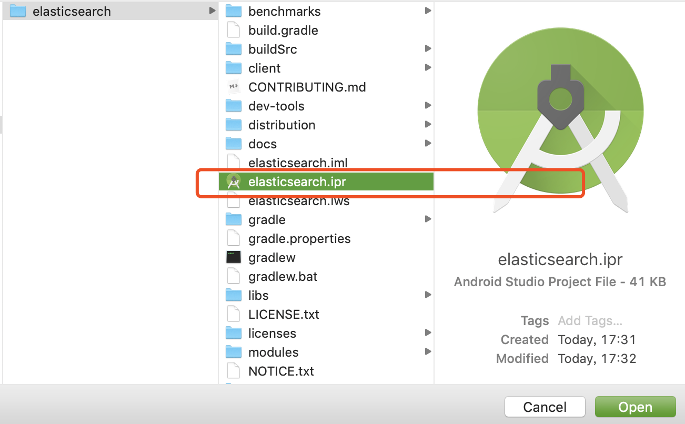
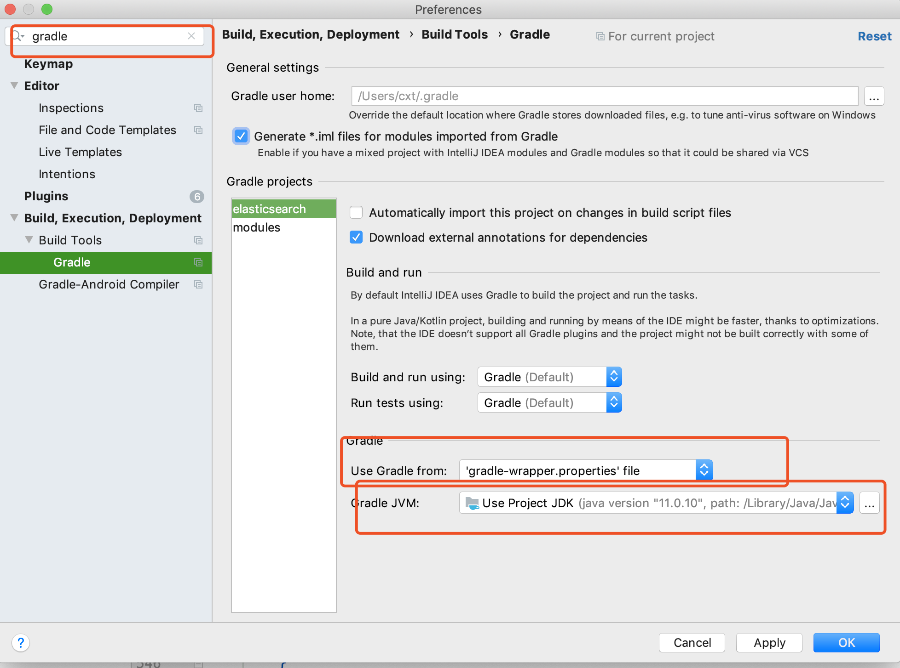
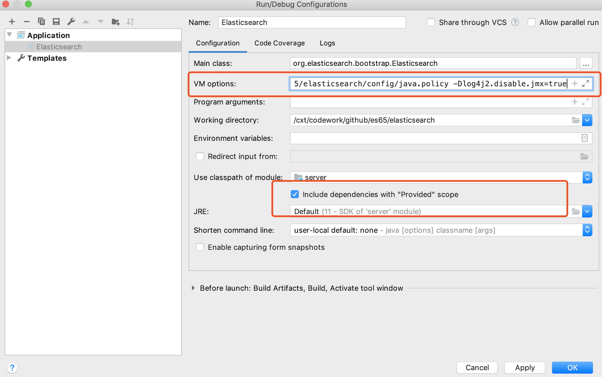

Elasticsearch 源码编译笔记

# 6.5

https://www.elastic.co/blog/how-to-debug-elasticsearch-source-code-in-intellij-idea

## 源码编译启动

* 环境

  * mac os 14
* jdk-11
  
  * gradle
* 本地 拉取 elasticsearch 源码放置位置，下面配置都是此为基础 /cxt/codework/github/es65/elasticsearch，最后一级为源码根目录
  
* gradle 安装配置阿里云地址加速

  * 安装教程这里就不写了，百度下怎么安装就行版本我这安装的最新版

  * 配置阿里云加速，找到安装的根目录，我这里是 /Users/cxt,在mac上就波浪线的目录,自己根据自己系统找到gradle安装目录即可

    创建init.gradle

    ```bash
    cd /Users/cxt
    # 此目录下有个隐藏文件夹gradle,注意小数点
    cd .gradle
    vim init.gradle 
    ```

  * init.gradle 内容如下

    ```text
    allprojects{
        repositories {
            def ALIYUN_REPOSITORY_URL = 'https://maven.aliyun.com/repository/public/'
            def ALIYUN_JCENTER_URL = 'https://maven.aliyun.com/repository/jcenter/'
            def ALIYUN_GOOGLE_URL = 'https://maven.aliyun.com/repository/google/'
            def ALIYUN_GRADLE_PLUGIN_URL = 'https://maven.aliyun.com/repository/gradle-plugin/'
            all { ArtifactRepository repo ->
                if(repo instanceof MavenArtifactRepository){
                    def url = repo.url.toString()
                    if (url.startsWith('https://repo1.maven.org/maven2/')) {
                        project.logger.lifecycle "Repository ${repo.url} replaced by $ALIYUN_REPOSITORY_URL."
                        remove repo
                    }
                    if (url.startsWith('https://jcenter.bintray.com/')) {
                        project.logger.lifecycle "Repository ${repo.url} replaced by $ALIYUN_JCENTER_URL."
                        remove repo
                    }
                    if (url.startsWith('https://dl.google.com/dl/android/maven2/')) {
                        project.logger.lifecycle "Repository ${repo.url} replaced by $ALIYUN_GOOGLE_URL."
                        remove repo
                    }
                    if (url.startsWith('https://plugins.gradle.org/m2/')) {
                        project.logger.lifecycle "Repository ${repo.url} replaced by $ALIYUN_GRADLE_PLUGIN_URL."
                        remove repo
                    }
                }
            }
            maven { url ALIYUN_REPOSITORY_URL }
            maven { url ALIYUN_JCENTER_URL }
            maven { url ALIYUN_GOOGLE_URL }
            maven { url ALIYUN_GRADLE_PLUGIN_URL }
        }
    }
    ```

    

* 个人fork仓库已提交当前所有使用的文件，网速较快的小伙伴可以拉取参考一下

  ```text
  https://github.com/TianPuJun/elasticsearch/tree/6.5
  ```

  

* 拉取源码

  ```text
  https://github.com/elastic/elasticsearc
  ```

  

* 切换分支6.5

  ```text
  cd elasticsearch
  git checkout 6.5
  ```

  

* 下载同版本二进制安装包为后面启动做准备,此处下载6.5.4的对应版本，6.5的最高子版本，其它版本可自行查阅

  ```text
  https://artifacts.elastic.co/downloads/elasticsearch/elasticsearch-6.5.4.tar.gz
  // 其它版本参考链接
  https://www.elastic.co/downloads/past-releases#elasticsearch
  ```


* 下载gradle-4.10-all.zip

  为什么下载这个版本呢，是因为我在下载完elasticsearch源码之后，

  查看elasticsearch/gradle/wrapper/gradle-wrapper.properties里面distributionUrl指定的为gradle-4.10-all.zip 鉴于国内网络原因，先下载下来，更改使用本地

  * 下载gradle-4.10-all.zip

    ```text
    https://services.gradle.org/distributions/gradle-4.10-all.zip
    ```

  * 复制gradle-4.10-all.zip到elasticsearch/gradle/wrapper/gradle-4.10-all.zip,与gradle-wrapper.properties同级

  * 更改elasticsearch/gradle/wrapper/gradle-wrapper.properties内容如下,主要是distributionUrl指定同级别目录下的gradle-4.10-all.zip即可

    ```text
    distributionBase=GRADLE_USER_HOME
    distributionPath=wrapper/dists
    distributionUrl=gradle-4.10-all.zip
    zipStoreBase=GRADLE_USER_HOME
    zipStorePath=wrapper/dists
    distributionSha256Sum=fc049dcbcb245d5892bebae143bd515a78f6a5a93cec99d489b312dc0ce4aad9
    
    ```

    

* 执行编译 为做导入idea做准备

  ```bash
  cd elasticsearch
  # 执行编译idea命令，如果报错可以根据提示加入命令参考排查，我这执行了一下./gradlew build 然后在执行gradle idea 就成功了
  ./gradlew idea
  ```

  

* 导入idea

  * 上一步gradlew idea执行成功之后会在elasticsearch 目录下面生成一个``elasticsearch.ipr ``文件，此时打开idea ，选择open 这个ipr文件即可自动导入

    注意：此处导入方式可使用idea import Project ，但是本人在使用中发现导入不进去，然后使用open elasticsearch.ipr的方式可以正常启动，这个看个人情况吧

    

  * 导入之后选择右上角Project Structure ，设置项目JDK为11

  * 打开gradle设置，设置gradle 中Grad 了JVM为 Use Project JDK

    

  

* 复制二进制安装文件导入源码编译文件夹

  * 解压刚才下载的elasticsearch-6.5.4.tar.gz 压缩包

  * 复制elasticsearch-6.5.4/config文件夹到源码elasticsearch/config

  * elasticsearch/config下新建java.policy

    内容为

    ```text
    grant {
        permission java.lang.RuntimePermission "createClassLoader";
    };
    ```

    

  * 在源码elasticsearch文件夹下新建文件夹home

  * 复制elastic search-6.5.4/modules到源码elasticsearch/home/modules

  * 完成的目录结构大体如下

    elasticsearch(6.5分支)

    ​	------ config

    ​	------ home

    ​		------module

* 执行启动代码

  * 启动类位置
  
  ```java
  org.elasticsearch.bootstrap.Elasticsearch#main
  ```
  
  * 编辑启动配置
  
    VM options 加入参数,参数含义见下方启动问题解决模块解析
  
    ```text
    -Des.path.conf=/cxt/codework/github/es65/elasticsearch/config 
    -Des.path.home=/cxt/codework/github/es65/elasticsearch/home 
    -Djava.security.policy=/cxt/codework/github/es65/elasticsearch/config/java.policy 
    -Dlog4j2.disable.jmx=true
    ```
  
    
  
  * 设置include dependencies
  
    
  
  * 启动es
  
    执行main方法
  
  * 访问 http://localhost:9200/  启动成功
### 启动问题解决

* 问题1: the system property [es.path.conf] must be set

  解决： 加入下方启动参数

  ```text
  -Des.path.conf=/cxt/codework/github/es65/elasticsearch/config
  ```

  

* 问题2: Exception in thread "main" java.lang.IllegalStateException: path.home is not configured

  解决： 加入下方启动参数

  ```text
  -Des.path.home=/cxt/codework/github/es65/elasticsearch/home
  ```

* 问题3: Could not register mbeans java.security.AccessControlException: access denied ("javax.management.MBeanTrustPermission" "register")

  解决：

  * 新建java.policy

    ```text
    grant {
        permission java.lang.RuntimePermission "createClassLoader";
    };
    ```

    

  * 加入启动参数

    ```text
    -Djava.security.policy=/cxt/codework/github/es65/elasticsearch/config/java.policy 
    -Dlog4j2.disable.jmx=true
    ```

    

* 问题4: Plugin [percolator] was built for Elasticsearch version 6.5.4 but version 6.5.5 is running

  解决：

  注释掉 org.elasticsearch.plugins.PluginsService里面verifyCompatibility(bundle.plugin);这一行代码


## attach 进程调试（一种更简单的调试源码方式）

* 拉取代码切换分支启动debug调试

  ```text
  
  git checkout 6.5 
  
  ./gradlew run --debug-jvm 
  ```

  

* 打开idea attach进程，位置Run-》Attach to Process，选中刚才启动的程序


# 6.5 API 调试


## Index

* 位置

  ```text
  org.elasticsearch.rest.action.admin.indices.RestCreateIndexAction
  ```
  
* 调用链

  ```text
  1、RestController.dispatchRequest
  2、RestController.tryAllHandlers
  3、RestController.getAllHandlers(获取分发请求使用的handle，获取返回requestHandled=true停止循环)
  4、RestController.dispatchRequest
  5、BaseRestHandler.handleRequest
  6、RestIndexAction.prepareRequest（封装IndexRequest，注册响应回调类 RestStatusToXContentListener）
  7、RestStatusToXContentListener.buildResponse(封装响应)
  ```


## Search

* 位置

  ```
  org.elasticsearch.rest.action.search.RestSearchAction
  ```

