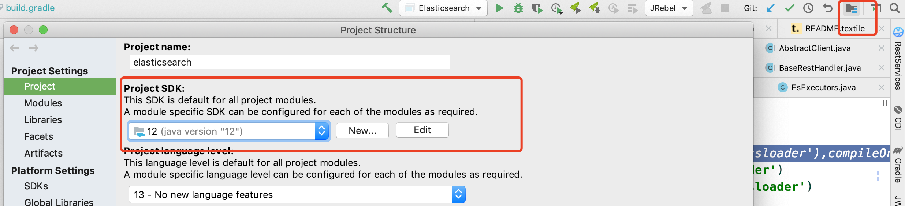

# Elasticsearch 7.4.3 源码编译记录

- 建议：不要使用本机装的gradle，编译时会自动下载匹配版本的gradle

# 环境

* Macos 10.4
* idea 2019
* jdk12
* elasticsearch7.4 代码

# 编译过程

* 1、克隆代码

    https://github.com/elastic/elasticsearch/tree/7.4
    
* 2、编译idea,这一步会自动下载对应版本的gradle，需要设置好java版本为jdk12

  ```text
  cd elasticsearch
  ./gradlew idea
  ```
  
* 3、导入idea，选择导入

  
  
  
  
  选中 build.gradle ，idea会提示是否导入gradle项目，选择是
  
  
  
  

* 4、打包对应版本的发行版文件，为一会启动做准备.这一步参考`elasticsearch/TESTING.assciidoc`文件

  ```text
  cd elasticsearch
  ./gradlew assemble
  ```

* 5、打包成功之后，到`elasticsearch/distribution/packages`下找到自己对应系统的发行版文件


* 6、解压`elasticsearch-oss-7.4.3-SNAPSHOT-x86_64.rpm`,然后在`elasticsearch` 同级别目录下新建文件夹`home`,并把解压后的文件放到home文件夹下


* 7、找到`elasticsearch/server/build.gradle`,修改 compileOnly 改为compile,详细信息查看下面

  ```text
  // compileOnly project(':libs:elasticsearch-plugin-classloader'),compileOnly 改为compile
  ```

* 8、idea设置项目JDK与gradle版本

  

  gradle版本与项目jdk保持一致

  

* 9、指定刚才新建的home文件夹地址中的配置文件与数据存放地址，参数内容如下

  ```text
  -Des.path.conf=/cxt/codework/github/elasticsearch/7.4/home/config
  -Des.path.home=/cxt/codework/github/elasticsearch/7.4/home
  -Djava.security.policy=/cxt/codework/github/elasticsearch7.4/home/config/java.policy
  -Dlog4j2.disable.jmx=true
  ```

  Java.policy 文件内容如下

  ```text
  grant {
      permission java.lang.RuntimePermission "createClassLoader";
  };
  ```

  

  

  

* 10、到这，如果还不能启动，那就尽情的谷歌与百度吧，也欢迎留言一起讨论

# 遇到的报错


## 报错一

ERROR: the system property [es.path.conf] must be set

解决方案参考第九步

## 报错二

Caused by: java.lang.ClassNotFoundException: org.elasticsearch.plugins.ExtendedPluginsClassLoader

解决参考第七步

# 总结

编译失败的原因很大一部分是

1、gradle版本问题，jdk版本问题，所以多看代码中自带的`CONTRIBUTING.md`,`README.textile`,`TESTING.asciidoc`,确认当前版本所依赖的环境版本要求，起码能少踩很多的坑

2、本身如果安装了gradle，确保安装的gradle不要对项目生效，尽量使用代码中`elasticsearch/gradle`中文件夹指定的gradle，如果要使用本机安装的gradle，请确保gradle版本对项目版本兼容

3、把上面第七步，第九步的参数都配置基本问题不大了，实在打包不成功，也可以去官网下载发行版

# 原文链接

https://mp.weixin.qq.com/s?__biz=MzIwNzYzODIxMw==&mid=2247484788&idx=1&sn=6eed8b35adbdc18a70a540d0284d0074&chksm=970e1edea07997c8cd43a02c375b0008b8227dd7c7e77db712dea55fe4548606bf981cc13cde#rd

# 参考链接

https://elasticsearch.cn/question/8243