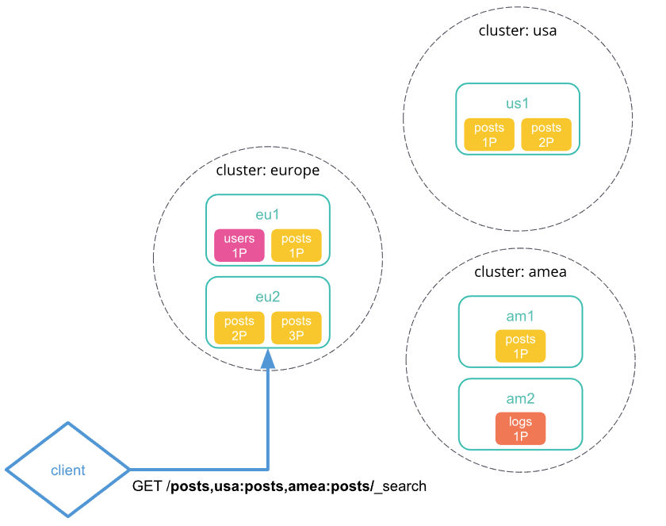
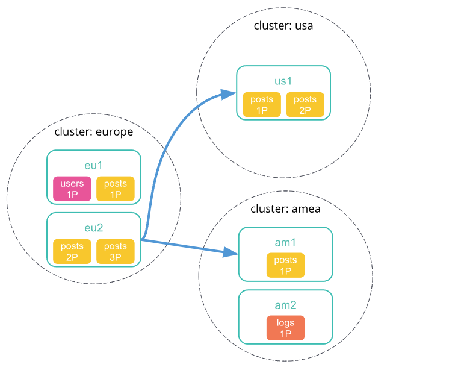
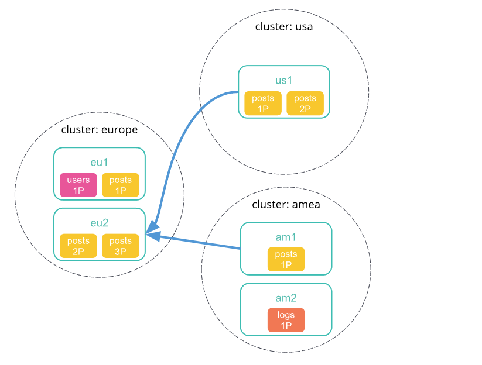
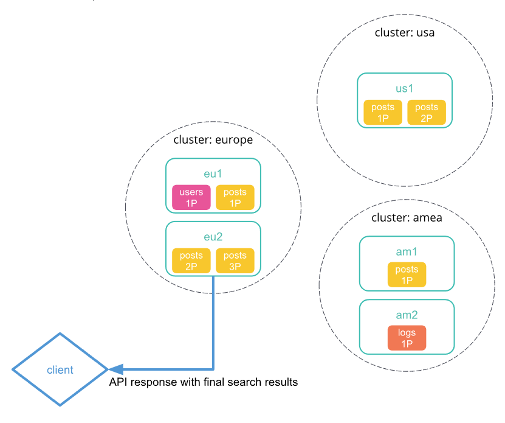
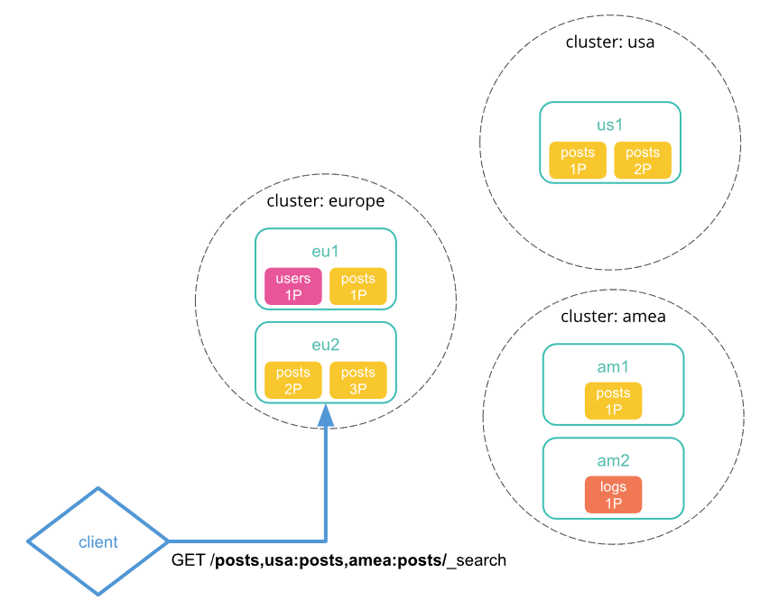
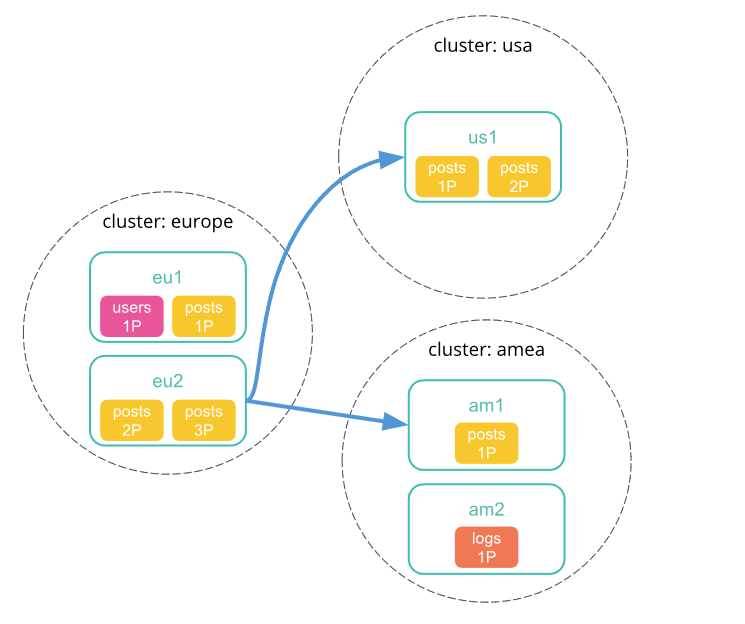
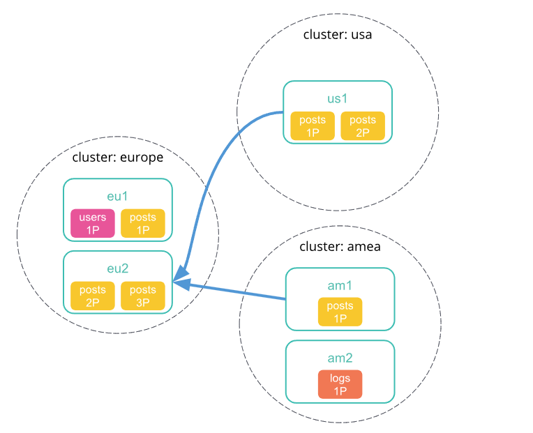
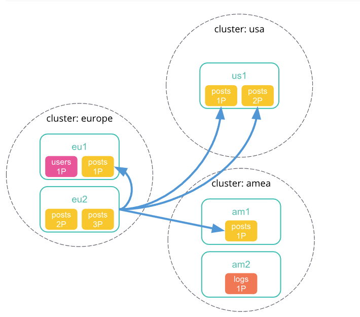
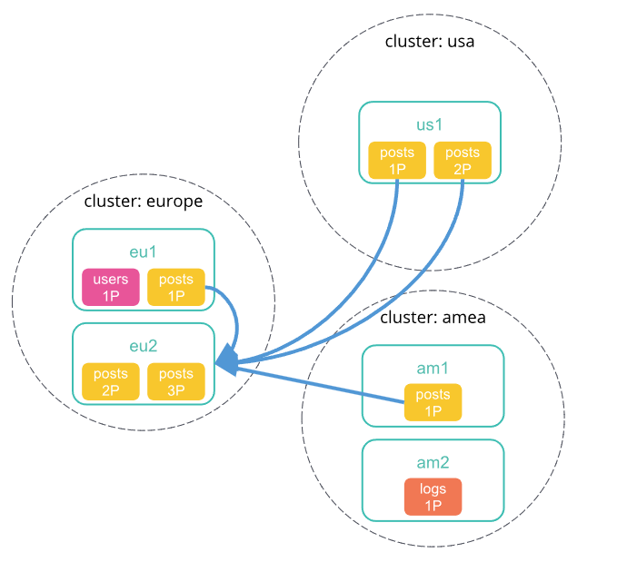
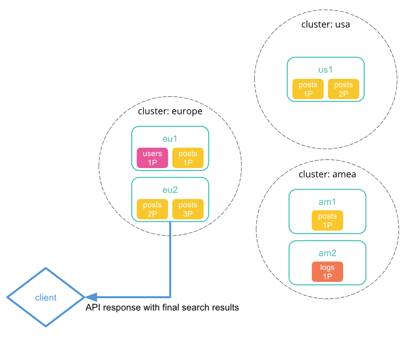

跨集群检索字面意思，同一个检索语句，可以检索到多个ES集群中的数据，ES集群默认是支持跨集群检索的，只需要动态的增加入节点即可，下面跟我一起来体验下ES的跨集群检索的魅力。

> Elasticsearch 跨集群检索推荐的是不同集群版本是相同的。

对于 `Elasticsearch `的 `8.1.3 `版本，跨集群检索对应的 `Elasticsearch` 的版本信息如下，通过看图可以知道，`Elasticsearch` 的 `8.1` 版本最多支持到 `7.17` 版本。


>  图片来源：https://www.elastic.co/guide/en/elasticsearch/reference/8.1/modules-cross-cluster-search.html

跨集群检索语句等实际操作跳过环境这一节，直接跳转文章底部查看。

# 环境

## 集群一：es-docker-cluster

集群一为`IP:192.168.160.245`这台机器上面以docker形式部署的`ES 8.1.3`集群，集群名为`es-docker-cluster`

```yml
version: '3.8'
services:
  cerebro:
    image: lmenezes/cerebro:0.8.3
    container_name: cerebro
    ports:
     - "9000:9000"
    command:
     - -Dhosts.0.host=http://eshot:9200
    networks:
     - elastic
  kibana:
    image: docker.elastic.co/kibana/kibana:8.1.3
    container_name: kibana
    environment:
      - I18N_LOCALE=zh-CN
      - XPACK_GRAPH_ENABLED=true
      - TIMELION_ENABLED=true
      - XPACK_MONITORING_COLLECTION_ENABLED="true"
      - ELASTICSEARCH_HOSTS=http://eshot:9200
      - server.publicBaseUrl=http://192.168.160.245:5601
    ports:
      - "5601:5601"
    networks:
      - elastic
  eshot:
    image: elasticsearch:8.1.3
    container_name: eshot
    environment:
      - node.name=eshot
      - cluster.name=es-docker-cluster
      - discovery.seed_hosts=eshot,eswarm,escold
      - cluster.initial_master_nodes=eshot,eswarm,escold
      - bootstrap.memory_lock=true
      - "ES_JAVA_OPTS=-Xms512m -Xmx512m"
      - xpack.security.enabled=false
      - node.attr.node_type=hot
    ulimits:
      memlock:
        soft: -1
        hard: -1
    volumes:
      - D:\zuiyuftp\docker\es8.1\eshot\data:/usr/share/elasticsearch/data
      - D:\zuiyuftp\docker\es8.1\eshot\logs:/usr/share/elasticsearch/logs
      - D:\zuiyuftp\docker\es8.1\eshot\plugins:/usr/share/elasticsearch/plugins
    ports:
      - 9200:9200
      - 9300:9300
    networks:
      - elastic
  eswarm:
    image: elasticsearch:8.1.3
    container_name: eswarm
    environment:
      - node.name=eswarm
      - cluster.name=es-docker-cluster
      - discovery.seed_hosts=eshot,eswarm,escold
      - cluster.initial_master_nodes=eshot,eswarm,escold
      - bootstrap.memory_lock=true
      - "ES_JAVA_OPTS=-Xms512m -Xmx512m"
      - xpack.security.enabled=false
      - node.attr.node_type=warm
    ulimits:
      memlock:
        soft: -1
        hard: -1
    volumes:
      - D:\zuiyuftp\docker\es8.1\eswarm\data:/usr/share/elasticsearch/data
      - D:\zuiyuftp\docker\es8.1\eswarm\logs:/usr/share/elasticsearch/logs
      - D:\zuiyuftp\docker\es8.1\eshot\plugins:/usr/share/elasticsearch/plugins
    networks:
      - elastic
  escold:
    image: elasticsearch:8.1.3
    container_name: escold
    environment:
      - node.name=escold
      - cluster.name=es-docker-cluster
      - discovery.seed_hosts=eshot,eswarm,escold
      - cluster.initial_master_nodes=eshot,eswarm,escold
      - bootstrap.memory_lock=true
      - "ES_JAVA_OPTS=-Xms512m -Xmx512m"
      - xpack.security.enabled=false
      - node.attr.node_type=cold
    ulimits:
      memlock:
        soft: -1
        hard: -1
    volumes:
      - D:\zuiyuftp\docker\es8.1\escold\data:/usr/share/elasticsearch/data
      - D:\zuiyuftp\docker\es8.1\escold\logs:/usr/share/elasticsearch/logs
      - D:\zuiyuftp\docker\es8.1\eshot\plugins:/usr/share/elasticsearch/plugins
    networks:
      - elastic

# volumes:
#   eshotdata:
#     driver: local
#   eswarmdata:
#     driver: local
#   escolddata:
#     driver: local

networks:
  elastic:
    driver: bridge

```


## 集群二：zuiyu-application

集群二为`IP:192.168.160.31`机器上面部署的`ES8.1.3`集群，集群名称为`zuiyu-application`他们三个的配置分别如下

### node1

```properties
cluster.name: zuiyu-application
node.name: node-1
path.data: D:\elasticsearch-8.1.3-windows-x86_64\elasticsearch-8.1.3/813/data
path.logs: D:\elasticsearch-8.1.3-windows-x86_64\elasticsearch-8.1.3/813/logs
network.host: 192.168.160.31
http.port: 9200
transport.port: 9300
cluster.initial_master_nodes: ["node-1"]
discovery.seed_hosts: ["192.168.160.31:9300", "192.168.160.31:9302","192.168.160.31:9303"]
xpack.security.enabled: false
xpack.security.enrollment.enabled: false
xpack.security.http.ssl:
  enabled: false
  keystore.path: certs/http.p12
xpack.security.transport.ssl:
  enabled: false
  verification_mode: certificate
  keystore.path: certs/transport.p12
  truststore.path: certs/transport.p12
```


### node2

```properties
cluster.name: zuiyu-application
node.name: node-2
path.data: D:\elasticsearch-8.1.3-windows-x86_64\node2/813/data
path.logs: D:\elasticsearch-8.1.3-windows-x86_64\node2/813/logs
network.host: 192.168.160.31
http.port: 9202
transport.port: 9302
cluster.initial_master_nodes: [node-2"]
discovery.seed_hosts: ["192.168.160.31:9300", "192.168.160.31:9302","192.168.160.31:9303"]
xpack.security.enabled: false
xpack.security.enrollment.enabled: false
xpack.security.http.ssl:
  enabled: false
  keystore.path: certs/http.p12
xpack.security.transport.ssl:
  enabled: false
  verification_mode: certificate
  keystore.path: certs/transport.p12
  truststore.path: certs/transport.p12
```


### node3

```properties
cluster.name: zuiyu-application
node.name: node-3
path.data: D:\elasticsearch-8.1.3-windows-x86_64\node3/813/data
path.logs: D:\elasticsearch-8.1.3-windows-x86_64\node3/813/logs
network.host: 192.168.160.31
http.port: 9203
transport.port: 9303
cluster.initial_master_nodes: ["node-3"]
discovery.seed_hosts: ["192.168.160.31:9300", "192.168.160.31:9302","192.168.160.31:9303"]
xpack.security.enabled: false
xpack.security.enrollment.enabled: false
xpack.security.http.ssl:
  enabled: false
  keystore.path: certs/http.p12
xpack.security.transport.ssl:
  enabled: false
  verification_mode: certificate
  keystore.path: certs/transport.p12
  truststore.path: certs/transport.p12
```


现在环境已经搭建好了，下面 进入实验环节，首先打开集群`es-docker-cluster`所对应的`kibana`

> Kibana 自行安装


# 跨集群检索


* 先对集群 `es-docker-cluster`设置跨集群检索的集群信息

  ```text
  PUT _cluster/settings
  {
    "persistent": {
      "cluster": {
        "remote": {
          "zuiyu-application": {
            "seeds": [
              "192.168.160.31:9300"
            ]
          }
        }
      }
    }
  }
  
  ```

  其中`zuiyu-application` 为自定义的跨集群检索的名称

* 在当前集群`es-docker-cluster` 中插入一条数据

  ```text
  POST zfc-doc-000011/_doc/1
  {
    "name":"zuiyu",
    "content":"test cluster doc 1"
  }
  ```

  

* 打开集群 `zuiyu-application`对应的`Kibana`，同样进行增加一条数据，使他们的 `name` 的值都是 `zuiyu` 

  ```text
  # 集群 zuiyu-application 中插入
  POST zfc-doc-000011/_doc/1
  {
    "name":"zuiyu",
    "content":"test cluster doc 2,this doc in cluster zuiyu-application"
  }
  ```

  到这，基础的测试数据已经完成，开始跨集群检索

* 指定集群进行检索x

  > GET /集群名:索引名/_search

  ```text
  GET /zuiyu-application:zfc-doc-000011/_search
  {
    "query": {
      "term": {
        "name": "zuiyu"
      }
    },
    "_source": ["name", "content"]
  }
  ```

  响应结果如下，可以看到已经在集群 `zuiyu-application`中查询出来数据了

  

* 跨集群检索

  同时检索`es-docker-cluster`与`zuiyu-application`两个集群中索引为`zfc-doc-000011`中的内容

  ```text
  GET zfc-doc-000011,zuiyu-application:zfc-doc-000011/_search
  {
    "query": {
      "term": {
        "name": "zuiyu"
      }
    },
    "_source": ["name", "content"]
  }
  ```

  响应结果如下

  

因为我们是在 `es-docker-cluster`集群对应的`Kibana`中执行的，所以本集群的名称可以不用指定。如果想查询多个索引，只需要追加`集群名:索引名`即可。

基础的跨集群配置与检索就到此， 实际的使用中查询语句的条件等各个方法都会有限制，这个需要根据实际使用场景来进行修改了，反正现在怎么操作你会了，比着葫芦画瓢还不简单吗。


# 集群不可用时的处理

默认情况下，如果请求的远程集群返回错误或者不可用，跨集群检索将失败。此时我们可以使用 `skip_unavailable` ，设置该参数为 `true`，可以在远程集群不可用时跳过该集群。

修改语句如下，该语句设置将在集群 `zuiyu-application` 不可用时跳过该集群。

```text
PUT _cluster/settings
{
  "persistent": {
    "cluster.remote.zuiyu-application.skip_unavailable": false
  }
}
```


# 处理网络延迟的方式

* 最小化网络往返次数

  默认情况下，Elasticsearch 会减少与远程集群之间的网络往返次数。这就减少了网络延迟对搜索速度的影响。但是Elasticsearch  无法减少大型检索请求的网络往返次数，例如包含 `scroll` 或者 `inner_hits` 的请求。 `ccs_minimize_roundtrips` 的值为 `true` 时来使用此选项。

* 不要最小化网络往返次数

  对于 `scroll` 或者 `inner_hits` 的请求，Elasticsearch 会向每个远程集群发送多个传入传出请求。我们可以通过修改 `ccs_minimize_roundtrips` 的值为 `false` 来使用此选项。虽然说速度会较慢，但是对于低延迟网络还是很适用的。

  

  > 对于该参数`ccs_minimize_roundtrips` 不了解的可以参考这篇文章
  >
  > [枯燥无味的Elasticsearch检索参数字典](https://mp.weixin.qq.com/s/DC_2sv5icjR63wZ6XmK6MA)
  >
  > 打不开的复制链接地址到浏览器打开即可:  https://mp.weixin.qq.com/s/DC_2sv5icjR63wZ6XmK6MA

  

## 最小化网络往返次数

> 图片来自官网，可点击左下角原文链接

1、向本地集群中发送跨集群检索请求，该集群中的协调节点接收并解析请求。



2、协调节点向每个集群包括本地集群发送单个搜索请求。每个集群独立执行搜索请求。



3、每个远程集群响应检索结果给协调节点。



4、从每个集群收集结果之后，协调节点在跨集群检索请求响应中返回最终的结果。




## 不使用最小化网络往返次数

> 图片来自官网，可点击左下角原文链接

1、向本地集群中发送跨集群检索请求，该集群中的协调节点接收并解析请求。



2、协调节点向每个集群发送分片检索请求。



3、每个远程集群将其响应发送回协调节点。此响应包含跨集群检索请求将在其集群上执行的索引和分片的信息。



4、协调节点向每个分片发送检索请求，包括自己本身集群的分片。每个分片独立执行检索请求。

> 当网络的往返没有最小化时，因为会发送所有的分片进行检索，所以搜索的结果就好比全在协调节点中保存中一样。所以我们可以修改集群的检索设置，比如`action.search.shard_count.limit`, `pre_filter_shard_size`, `max_concurrent_shard_requests`，如果这些限制太低的话，检索请求可能会被直接拒绝。

对于该参数不了解的可以参考这篇文章

[枯燥无味的Elasticsearch检索参数字典](https://mp.weixin.qq.com/s/DC_2sv5icjR63wZ6XmK6MA)

打不开的复制链接地址到浏览器打开即可:  https://mp.weixin.qq.com/s/DC_2sv5icjR63wZ6XmK6MA



5、每个分片将检索结果返回给协调节点。



6、协调节点收集所有的结果后，在跨集群检索请求响应中返回最终的响应结果。




# Kibana 中远程集群查看

创建完成之后的远程集群可以在`Kibana`中查看 

