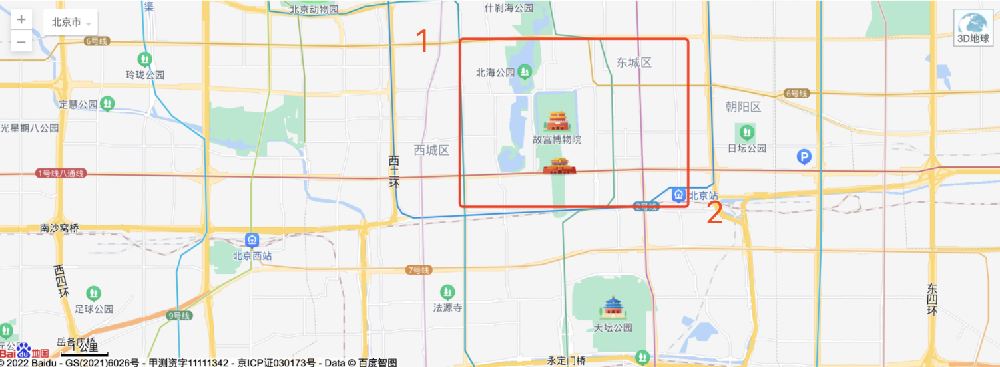
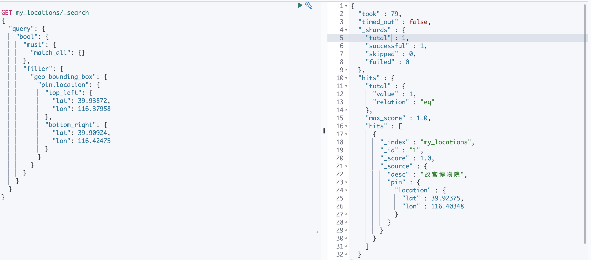
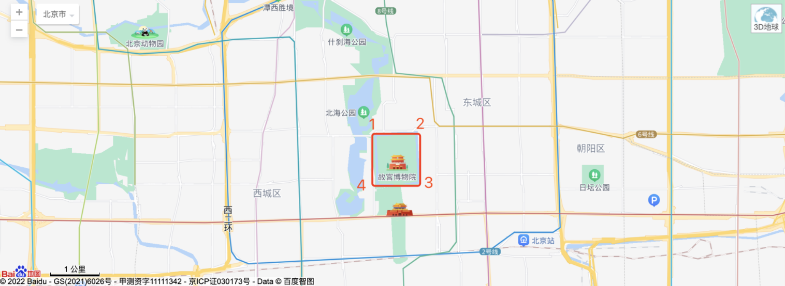
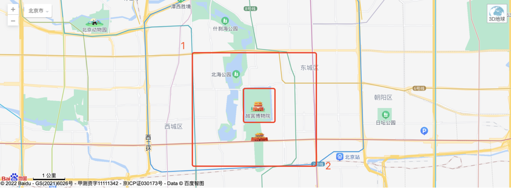
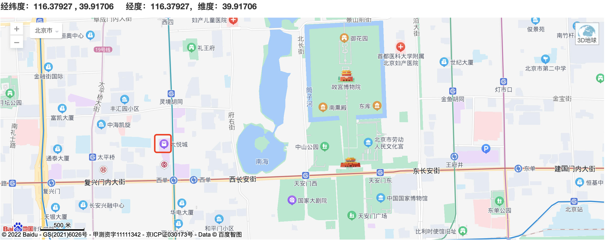
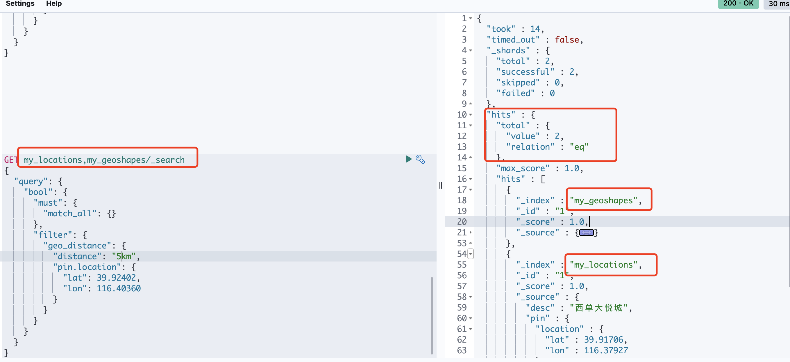
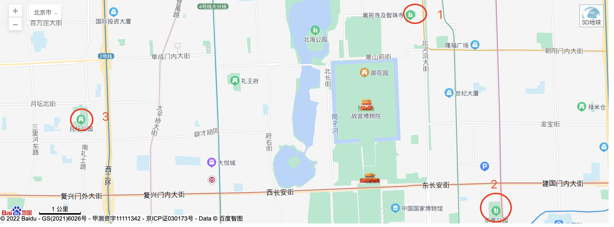

在我们使用elasticsearch创建索引时，经常会遇到一种字段类型为`geo_point`的数据类型，该类型的字段接收经纬度的值，那么`geo_point`类型的字段可以用来做什么？

* 基于Geo的地理位置范围查询
* 基于Geo范围内到中心点距离的聚合统计
* 加入到相关性得分计算中
* 基于Geo地理位置信息到中心点距离的排序

通过阅读本文，可以学到以上知识点，学到就是赚到，还不快快开始阅读吧

# 环境

* MacOS 10.14.6
* Elasticsearch 8.1
* Kibana 8.1

# 帮助信息

* **latitude: 纬度;longitude: 经度;**

* 获取地理位置坐标网站，看自己喜好

  > http://api.map.baidu.com/lbsapi/getpoint/index.html
  >
  > http://jingweidu.757dy.com/

* geohash生成

  如何获取一个地理位置的geohash以及根据geohash获取经纬度

  > https://www.dcode.fr/geohash-coordinates

  根据地理位置信息查看地图上展示

  > https://www.movable-type.co.uk/scripts/geohash.html

# Geopoint（点）

## 如何指定一个地理位置信息

Elasticsearch中`geo_point`类型的数据字段支持以下5种方式录入地理位置数据，分别如下：

首先我们还是先定义一个索引，创建一个数据类型为`geo_point`的字段

* 创建索引

  ```text
  PUT my-index-000001
  {
    "mappings": {
      "properties": {
        "text":{
          "type": "text"
        },
        "location":{
          "type": "geo_point"
        }
      }
    }
  }
  ```

  

* 作为一个对象传入位置信息

  ```text
  PUT my-index-000001/_doc/1
  {
    "text": "Geopoint as an object",
    "location": { 
      "lat": 41.12,
      "lon": -71.34
    }
  }
  ```

  

* 字符串形式写入`"lat,lon"`

  ```text
  PUT my-index-000001/_doc/2
  {
    "text": "Geopoint as a string",
    "location": "41.12,-71.34" 
  }
  ```

  

* geohash形式写入

  ```text
  PUT my-index-000001/_doc/3
  {
    "text": "Geopoint as a geohash",
    "location": "drm3btev3e86" 
  }
  ```

  

* 数组`[lon,lat]`

  ```text
  
  PUT my-index-000001/_doc/4
  {
    "text": "Geopoint as an array",
    "location": [ -71.34, 41.12 ] 
  }
  ```

  

* POINT 文本`"POINT(lon lat)"`

  ```text
  PUT my-index-000001/_doc/5
  {
    "text": "Geopoint as a WKT POINT primitive",
    "location" : "POINT (-71.34 41.12)" 
  }
  ```

* 基于一定地理位置边界的查询

  ```text
  GET my-index-000001/_search
  {
    "query": {
      "geo_bounding_box": { 
        "location": {
          "top_left": {
            "lat": 43,
            "lon": -72
          },
          "bottom_right": {
            "lat": 40,
            "lon": -74
          }
        }
      }
    }
  }
  
  ```
  
  通过上面的例子可以看出`geo_point`类型的字段可以同时接收五种参数形式的数据写入，并且丝毫不影响查询，就是这么强大，还不快用起来，温馨提醒，千万不要为了用而用哦

## geo_point 类型字段支持的参数

* ignore_malformed

  默认`false`,写入文档时遇到不符合规范的地理位置信息字段值会抛出异常，如果为`true`，则会忽略。如果设置了`script`字段，该字段将不能使用

* ignore_z_value

  默认`true`，三维空间信息将被记录，但是只有经纬度的值能被索引，如果为`false`，写入文档时如果有超过二维的信息，抛出异常拒绝文档写入

* index

  是否可以被索引，默认`true`,如果为`false`，未建立索引的字段将不能被检索

* null_value

  默认值为`null`，如果设置为`null`，则意味着该字段是不存在的，如果使用了`script`，则该字段不可被设置

* on_script_error

  只有设置了`script`字段的时候才可以设置该字段，定义使用脚步发生错误时如何处理，默认`fail`，拒绝整个文档，但是会继续，在元数据字段中注册该字段

* script

  脚本字段，如果设置了该值，将索引该脚本执行之后的结果，如果在写文档的时候给该字段设置了值，文档将会被拒绝。脚本的格式与运行时相同，应该是一对`(lat,lon)`双值的形式

## 在脚本中使用geopoints

当在脚本中访问`geopoint`类型的值时，该值做为`GeoPoint`对象返回，可以使用如下方式读取

```text
def geopoint = doc['location'].value;
def lat      = geopoint.lat;
def lon      = geopoint.lon;
```

但是更推下如下这样读取

```text
def lat      = doc['location'].lat;
def lon      = doc['location'].lon;
```

# Geoshape（形状）

对几何形状进行索引和查询（矩形和多边形），当索引的数据和查询包含除了点以外的形状时应该使用`geo_shape`类型

通过上面这俩类型的描述，我们可以得出一个结论，就是`geo_point`表示一个点，`geo_shape`表示多个点连接线组成的形状

## 支持的映射参数

`geo_shape` 映射将`GeoJSON`几何对象映射到`geo_shape`，要是用该映射类型，必须显式的设置，这句话意思就是我们使用该数据类型的时候必须明确指定索引类型

* orientation

  可选参数，WKT多边形的默认方向，默认`RIGHT`逆时针。`LEFT`顺时针

  如果要指定`RGIHT`可以使用如下值设置

  * right
  * counterclockwise
  * ccw

  如果要指定`LEFT`可以使用如下值设置

  * left
  * clockwise
  * cw

  > WKT(Well-known text)是一种文本标记语言，用于表示矢量几何对象、空间参照系统及空间参照系统之间的转换

* ignore_malformed

  默认`false`，如果是不符合`GeoJSON`或者`WKT`的格式抛出异常，如果为`true`，则忽略

* ignore_z_value

  默认`true`，三维空间信息将被记录，但是只有经纬度的值能被索引，如果为`false`，写入文档时如果有超过二维的信息，抛出异常拒绝文档写入

* Coerce

  默认`false`，如果为`true`，如果是非封闭的多边形将自动闭合形成封闭的多边形

## 创建索引

```text
PUT /example
{
  "mappings": {
    "properties": {
      "location": {
        "type": "geo_shape"
      }
    }
  }
}
```

## 输入类型

地理位置形状信息可以使用`GeoJSON`或者`WKT`表示，下面是`GeoJSON`，`WKT`与`Elasticsearch`中类型的对应关系

| GeoJSON Type       | WKT Type           | Elasticsearch Type | description                                                  |
| ------------------ | ------------------ | ------------------ | ------------------------------------------------------------ |
| Point              | POINT              | Point              | 单一的经纬度坐标                                             |
| LineString         | LINTSTRING         | lingstring         | 给定两个点或多个点组成的任意直线                             |
| Polygon            | POLYGON            | polygon            | 封闭的多边形，第一个点和最后一个点必须匹配，也就是`n+1`个点形成的`n`边多边形，至少`4`个顶点 |
| MultiPoint         | MULTIPOINT         | multipoint         | 一组不相连但是可能相关的点                                   |
| MultiLineString    | MULTILINESTRING    | multilinestring    | 单独的行字符串组成的数组                                     |
| MultiPolygon       | MULTIPOLYGON       | multipolygon       | 单独的多边形数组                                             |
| GeometryCollection | GEOMETRYCOLLECTION | geometrycollection | 与multi开头的类型类似的一个GeoJSON形状，但是多个类型可以共同存在比如（Point和LineString同时存在） |
| N/A                | BBOX               | envelope           | 仅指定左上角和右下角两个点组成的边框或包                     |

对于所有的类型都应该有子类型和字段坐标，**在`GeoJSON`、`WKT`以及`Elasticsearch`中，坐标信息都是(经度，纬度)**，这与很多的地理信息API是不同的，**地图地理信息API通常使用(纬度，经度)**，这一点是需要注意的一个地方，下面我将针对以上集中类型情况分别做一个写入数据的测试

* 点 

  点的话比较简单，就比如手机定位，或者某个建筑的位置信息

  ```text
  # GeoJSON
  POST /example/_doc
  {
    "location" : {
      "type" : "Point",
      "coordinates" : [-77.03653, 38.897676]
    }
  }
  # WKT
  POST /example/_doc
  {
    "location" : "POINT (-77.03653 38.897676)"
  }
  ```

  

* 线

  由两个或者多个数组以上定义的行字符串，通过指定两个点，linestring将表示一条线，两个以上的点表示任意路径

  ```text
  # GeoJSON
  POST /example/_doc
  {
    "location" : {
      "type" : "LineString",
      "coordinates" : [[-77.03653, 38.897676], [-77.009051, 38.889939]]
    }
  }
  # WKT
  POST /example/_doc
  {
    "location" : "LINESTRING (-77.03653 38.897676, -77.009051 38.889939)"
  }
  ```

  

* 多边形

  多边形是由多个点定义的，列表的第一个点和最后一个点必须相同

  ```text
  # GeoJSON
  POST /example/_doc
  {
    "location" : {
      "type" : "Polygon",
      "coordinates" : [
        [ [100.0, 0.0], [101.0, 0.0], [101.0, 1.0], [100.0, 1.0], [100.0, 0.0] ]
      ]
    }
  }
  # WKT
  POST /example/_doc
  {
    "location" : "POLYGON ((100.0 0.0, 101.0 0.0, 101.0 1.0, 100.0 1.0, 100.0 0.0))"
  }
  ```

  上面这个定义的是一个多边形，下面定义一个带洞的多边形，下面例子中，第一个数组代表多边形外部边界，第二个数组代表内部洞的边界

  ```text
  # GeoJSON
  POST /example/_doc
  {
    "location" : {
      "type" : "Polygon",
      "coordinates" : [
        [ [100.0, 0.0], [101.0, 0.0], [101.0, 1.0], [100.0, 1.0], [100.0, 0.0] ],
        [ [100.2, 0.2], [100.8, 0.2], [100.8, 0.8], [100.2, 0.8], [100.2, 0.2] ]
      ]
    }
  }
  # WKT
  POST /example/_doc
  {
    "location" : "POLYGON ((100.0 0.0, 101.0 0.0, 101.0 1.0, 100.0 1.0, 100.0 0.0), (100.2 0.2, 100.8 0.2, 100.8 0.8, 100.2 0.8, 100.2 0.2))"
  }
  ```

  

* 多边形的方向

  多边形的方向也就是顶点的顺序，有`Right`逆时针和`Left`顺时针，Elasticsearch使用多边形的方向来确认是否跨越了国际日期线(+-180度)

  因为WKT没有指定或者强制默认方向，我们可以使用方向映射的参数`orientation`来设置多边形的方向

  GeoJSON默认使用Right的方向,与参数`orientation`设置无关,GeoJSON规范要求外部多边形使用逆时针，内部多边形使用顺时针

  但是可以使用文档级别的参数`orientation`覆盖来重写GeoJSON的默认方向,如下所示多边形方向就是`Left`

  ```text
  POST /example/_doc
  {
    "location" : {
      "type" : "Polygon",
      "orientation" : "LEFT",
      "coordinates" : [
        [ [-177.0, 10.0], [176.0, 15.0], [172.0, 0.0], [176.0, -15.0], [-177.0, -10.0], [-177.0, 10.0] ]
      ]
    }
  }
  ```

  Elasticsearch 仅使用多边形的方向来确定是否跨越了国际日期线，如果一个多边形的最小经度与最大经度差值小于180，那多边形就没有跨越国际日期线，对多边形的方向也就不会有影响

  如果多边形的最小经度与最大经度差值等于180或者大于180，则Elasticsearch会检查文档级别的orientation参数方向与默认的方向是否不同，如果方向不同，Elasticsearch会在跨越国际日期线的地方分割多边形

* 点的列表

  ```text
  # GeoJSON
  POST /example/_doc
  {
    "location" : {
      "type" : "MultiPoint",
      "coordinates" : [
        [102.0, 2.0], [103.0, 2.0]
      ]
    }
  }
  # WKT
  POST /example/_doc
  {
    "location" : "MULTIPOINT (102.0 2.0, 103.0 2.0)"
  }
  ```

  

* 线的列表

  ```text
  # GeoJSON
  POST /example/_doc
  {
    "location" : {
      "type" : "MultiLineString",
      "coordinates" : [
        [ [102.0, 2.0], [103.0, 2.0], [103.0, 3.0], [102.0, 3.0] ],
        [ [100.0, 0.0], [101.0, 0.0], [101.0, 1.0], [100.0, 1.0] ],
        [ [100.2, 0.2], [100.8, 0.2], [100.8, 0.8], [100.2, 0.8] ]
      ]
    }
  }
  #WKT
  POST /example/_doc
  {
    "location" : "MULTILINESTRING ((102.0 2.0, 103.0 2.0, 103.0 3.0, 102.0 3.0), (100.0 0.0, 101.0 0.0, 101.0 1.0, 100.0 1.0), (100.2 0.2, 100.8 0.2, 100.8 0.8, 100.2 0.8))"
  }
  ```

* 多个多边形

  如下代表两个多边形，其中第二个多边形包含一个洞

  ```text
  # GeoJSON
  POST /example/_doc
  {
    "location" : {
      "type" : "MultiPolygon",
      "coordinates" : [
        [ [[102.0, 2.0], [103.0, 2.0], [103.0, 3.0], [102.0, 3.0], [102.0, 2.0]] ],
        [ [[100.0, 0.0], [101.0, 0.0], [101.0, 1.0], [100.0, 1.0], [100.0, 0.0]],
          [[100.2, 0.2], [100.8, 0.2], [100.8, 0.8], [100.2, 0.8], [100.2, 0.2]] ]
      ]
    }
  }
  # WKT
  POST /example/_doc
  {
    "location" : "MULTIPOLYGON (((102.0 2.0, 103.0 2.0, 103.0 3.0, 102.0 3.0, 102.0 2.0)), ((100.0 0.0, 101.0 0.0, 101.0 1.0, 100.0 1.0, 100.0 0.0), (100.2 0.2, 100.8 0.2, 100.8 0.8, 100.2 0.8, 100.2 0.2)))"
  }
  ```

* 集合对象

  包含`Point`和`LineString`的例子

  ```text
  # GeoJSON
  POST /example/_doc
  {
    "location" : {
      "type": "GeometryCollection",
      "geometries": [
        {
          "type": "Point",
          "coordinates": [100.0, 0.0]
        },
        {
          "type": "LineString",
          "coordinates": [ [101.0, 0.0], [102.0, 1.0] ]
        }
      ]
    }
  }
  # WKT
  POST /example/_doc
  {
    "location" : "GEOMETRYCOLLECTION (POINT (100.0 0.0), LINESTRING (101.0 0.0, 102.0 1.0))"
  }
  ```

* envelope

  指定对角线的多边形，格式为`[[minLon,maxLat],[maxLon,minLat]]`

  ```text
  POST /example/_doc
  {
    "location" : {
      "type" : "envelope",
      "coordinates" : [ [100.0, 1.0], [101.0, 0.0] ]
    }
  }
  ```

  下面使用WKT的BBOX类型，WKT的格式顺序为`minLon，maxLon，maxLat，minLat`

  ```text
  POST /example/_doc
  {
    "location" : "BBOX (100.0, 102.0, 2.0, 0.0)"
  }
  ```
  
* 圆
  
  `GeoJSON`和`WKT`都不支持一个点的半径圆类型，但是可以使用`circle ingest processor`来近似的模拟一个圆来作为一个多边形

## 排序和检索

由于形状的输入结构复杂度和索引表示形状的复杂性，目前不能对索引进行排序或者直接检索他们的字段，目前`geo_shape`只能通过`_source`来检索

# 基于地理位置信息的范围查询

参考：https://kucw.github.io/blog/2019/12/elasticsearch-geo-point/

## Geo-bounding box query（矩形过滤）

> https://www.elastic.co/guide/en/elasticsearch/reference/8.1/query-dsl-geo-bounding-box-query.html

可以对数据类型为`geo_point`和`geo_shape`的值在矩形边框内进行检索，找出落在矩形内的点

### Geopoint 值的匹配

下面是一个演示一个点在一个矩形边框范围的一个例子，首先还是创建一个索引

* 创建索引 

  索引包含两个字段，`desc`为地点的描述信息，`pin.location`为具体的地理位置信息

  ```text
  PUT /my_locations
  {
    "mappings": {
      "properties": {
        "desc":{
          "type": "text"
        },
        "pin": {
          "properties": {
            "location": {
              "type": "geo_point"
            }
          }
        }
      }
    }
  }
  ```

  

* 插入一条测试数据，使用地图获取故宫博物院的坐标信息（位置信息与截图稍微有微微的偏差，为后期补充图片）

  

  ```text
  PUT /my_locations/_doc/1
  {
    "desc":"故宫博物院",
    "pin": {
      "location": {
        "lat": 39.92375,
        "lon": 116.40348
      }
    }
  }
  ```

  

* 定义下图所示的边界范围，矩形框内查询,`top_left`就是**顶点1**，`bottom_right`就是**顶点2**

  

  ```text
  GET my_locations/_search
  {
    "query": {
      "bool": {
        "must": {
          "match_all": {}
        },
        "filter": {
          "geo_bounding_box": {
            "pin.location": {
              "top_left": {
                "lat": 39.93872,
                "lon": 116.37958
              },
              "bottom_right": {
                "lat": 39.90924,
                "lon": 116.42475
              }
            }
          }
        }
      }
    }
  }
  ```

  查看返回结果可以获取到刚才插入的故宫博物院地点信息

  

### Geoshape 值的匹配

* 新建索引

  ```text
  PUT /my_geoshapes
  {
    "mappings": {
      "properties": {
        "desc":{
          "type": "text"
        },
        "pin": {
          "properties": {
            "location": {
              "type": "geo_shape"
            }
          }
        }
      }
    }
  }
  ```

  

* 插入测试数据,如下数据在地图展示如下，5个地理位置信息为图中矩形的顶点，顺时针第一个和最后一个保持相同如下地理位置信息数据的顺序依次为[1,2,3,4,1]

  ```text
PUT /my_geoshapes/_doc/1
  {
    "desc":"故宫博物院",
    "pin": {
      "location": {
        "type" : "polygon",
        "coordinates" : [[[116.39801,39.92905], [116.40774,39.92905], [116.40936,39.92063], [116.39761,39.92000], [116.39801,39.92905]]]
      }
    }
  }
  ```
  
  

* 查询范围内形状匹配的值

  ```text
  GET my_geoshapes/_search
  {
    "query": {
      "bool": {
        "must": {
          "match_all": {}
        },
        "filter": {
          "geo_bounding_box": {
            "pin.location": {
              "top_left": {
                "lat": 39.93872,
                "lon": 116.37958
              },
              "bottom_right": {
                "lat": 39.90794,
                "lon": 116.42486
              }
            }
          }
        }
      }
    }
  }
  ```
  
  上面的`top_left`对应的就是图中的**顶点1**，`bottom_right`对应的就是图中的**顶点2**
  
  

  检索结果如下
  
  


## Geo-distance query（圆形过滤）

> https://www.elastic.co/guide/en/elasticsearch/reference/8.1/query-dsl-geo-distance-query.html#query-dsl-geo-distance-query

以给定位置作圆点，画一个给定距离的圆，以匹配圆范围内的文档数据，下面我们用例子来说明这个圆形过滤

* 创建索引,`my_locations`测试`geo_point`,`my_geoshapes`测试`geo_shape`

  ```text
  PUT /my_locations
  {
    "mappings": {
      "properties": {
        "desc":{
          "type": "text"
        },
        "pin": {
          "properties": {
            "location": {
              "type": "geo_point"
            }
          }
        }
      }
    }
  }
  
  PUT /my_geoshapes
  {
    "mappings": {
      "properties": {
        "desc":{
          "type": "text"
        },
        "pin": {
          "properties": {
            "location": {
              "type": "geo_shape"
            }
          }
        }
      }
    }
  }
  ```

  

* 插入一个测试数据，地点信息为**西单大悦城**(**经纬度：116.37927 , 39.91706**)

  ```text
  PUT /my_locations/_doc/1
  {
    "desc":"西单大悦城",
    "pin": {
      "location": {
        "lat":39.91706 ,
        "lon": 116.37927
      }
    }
  }
  PUT /my_geoshapes/_doc/1
  {
    "desc":"西单大悦城",
    "pin": {
      "location": {
        "type" : "polygon",
        "coordinates" : [[[116.37855,39.91761], [116.38018,39.91756], [116.38024,39.91651], [116.37862,39.91636 ], [116.37855,39.91761]]]
      }
    }
  }
  
  ```

  

* 查询故宫博物院周边`5公里`的文档信息

  ```text
  GET /my_locations/_search
  {
    "query": {
      "bool": {
        "must": {
          "match_all": {}
        },
        "filter": {
          "geo_distance": {
            "distance": "5km",
            "pin.location": {
              "lat": 39.92402,
              "lon": 116.4036
            }
          }
        }
      }
    }
  }
  GET my_geoshapes/_search
  {
    "query": {
      "bool": {
        "must": {
          "match_all": {}
        },
        "filter": {
          "geo_distance": {
            "distance": "5km",
            "pin.location": {
              "lat": 39.92402,
              "lon": 116.40360
            }
          }
        }
      }
    }
  }
  ```

  查看结果可以得到距离为周边3公里内是搜索不到的，大于3公里就可以搜索到我们定义的西单大悦城的地点信息

  看下面例子，同时在`my_locations`和`my_geoshapes`两个索引中搜索故宫博物院周边5公里内的地点信息

  ```text
  GET my_locations,my_geoshapes/_search
  {
    "query": {
      "bool": {
        "must": {
          "match_all": {}
        },
        "filter": {
          "geo_distance": {
            "distance": "5km",
            "pin.location": {
              "lat": 39.92402,
              "lon": 116.40360
            }
          }
        }
      }
    }
  }
  ```

  

### 扩展知识

  在上文中我们也看到了，录入测试数据的方式支持多种，在使用过滤器查询数据的时候同样如此可以使用多种方式进行过滤，如下简单举例几种，比如

* 使用数组形式(`经度，纬度`)

  ```text
  GET /my_locations/_search
  {
    "query": {
      "bool": {
        "must": {
          "match_all": {}
        },
        "filter": {
          "geo_distance": {
            "distance": "5km",
            "pin.location": [ 116.40360,39.92402 ]
          }
        }
      }
    }
  }
  ```

  

* 使用字符串(`纬度，经度`)

  ```text
  GET /my_locations/_search
  {
    "query": {
      "bool": {
        "must": {
          "match_all": {}
        },
        "filter": {
          "geo_distance": {
            "distance": "5km",
            "pin.location": "39.92402,116.40360"
          }
        }
      }
    }
  }
  GET /my_geoshapes/_search
  {
    "query": {
      "bool": {
        "must": {
          "match_all": {}
        },
        "filter": {
          "geo_distance": {
            "distance": "5km",
            "pin.location": "39.92402,116.40360"
          }
        }
      }
    }
  }
  ```

  

* 使用geohash

  `geohash` 生成可以参考文章开头帮助信息中生成`geohash`的网站，也可以复制如下链接到浏览器打开，任选其一即可

  > https://www.dcode.fr/geohash-coordinates
  >
  > https://www.movable-type.co.uk/scripts/geohash.html

  ```text
  GET my_locations,my_geoshapes/_search
  {
    "query": {
      "bool": {
        "must": {
          "match_all": {}
        },
        "filter": {
          "geo_distance": {
            "distance": "5km",
            "pin.location": "wx4g0gfw22x"
          }
        }
      }
    }
  }
  ```

### 过滤查询接收的参数说明

* distance

  以指定的点为圆心，以`distance`的值为半径画圆，匹配圆内的地点信息数据，距离单位默认米(m),其他距离单位可以参考官网

  > https://www.elastic.co/guide/en/elasticsearch/reference/8.1/api-conventions.html#distance-units

* distance_type

  计算距离的方式，也就是`distance`生效的方式，默认是上述所说的为圆也就是弧形计算(`arc`)，另一个可选值是平面的(`plane`)，效率比`arc`快，但是精度有所损失，尤其是`distance`的值很大时或者两极处。`plane`比喻地球是平的，在赤道附近时精度是最佳的，靠近两级时精度略有损失。比如想找附近`5km`的地点，然后找到了`5.2km`的地点，这个误差取决于我们是否可以接受

* _name

  该查询语句的名称

* validation_method

  是否接受错误的地点坐标信息

  * `STRICT` `默认值`，抛出异常
  * `COERCE` 尝试修正错误坐标信息为正确的坐标
  * `IGNORE_MALFORMED` 允许无效的错误的地点坐标信息

`geo_distance`的过滤请求可以匹配一篇文档中的多个地点值，只要有一个地点值匹配，该文档就会被返回

`ignore_unmapped`字段的值设置为`true`，查询时如果字段`不匹配`，`会忽略报错，返回空文档`；如果设置为`false`，遇到不匹配的字段会 `抛出异常`

如下示例，匹配`pin.location1`字段，我们知道该字段在索引中是不存在的，所以当`ignore_unmapped`设置为`true`时返回空文档，设置为`false`时抛出异常

```text
GET my_locations,my_geoshapes/_search
{
  "query": {
    "bool": {
      "must": {
        "match_all": {}
      },
      "filter": {
        "geo_distance": {
          "ignore_unmapped":true,
          "_name":"zuiyuquery",
          "distance": "5km",
          "pin.location1": "wx4g0gfw22x"
        }
      }
    }
  }
}
```


## Geo-polygon query（自定义多边形过滤）

> https://www.elastic.co/guide/en/elasticsearch/reference/8.1/query-dsl-geo-polygon-query.html

多边形过滤，顾名思义就是查询条件定义个多边形，返回该多边形区域内的点的文档信息

> 官网已经说明es7.12版本开始废弃，推荐使用geoshape，参考后文的 geoshape query

该查询接收的参数有如下

* _name

  该查询语句的名称

* validation_method

  是否接受错误的地点坐标信息

  * `STRICT` `默认值`，抛出异常
  * `COERCE` 尝试修正错误坐标信息为正确的坐标
  * `IGNORE_MALFORMED` 允许无效的错误的地点坐标信息

需要注意的是，查询的字段需要设置为`geo_point`类型,同样`ignore_unmapped`字段的值设置为`true`，查询时如果字段`不匹配`，`会忽略报错，返回空文档`；如果设置为`false`，遇到不匹配的字段会 `抛出异常`

* 我们先插入一条故宫位置的信息文档

  ```text
  PUT /my_locations/_doc/2
  {
    "desc":"故宫",
    "pin":{
      "location":"39.92307,116.40291"
    }
  }
  ```

  

如下是对`pin.location`字段定义一个三条边的形状的过滤查询语句,三个点顺序【1，2，3】排列,此时该 查询会返回故宫的信息，但是刚才定的西单大悦城的信息就不会返回

```text
GET my_locations/_search
{
  "query": {
    "bool": {
      "must": {
        "match_all": {}
      },
      "filter": {
        "geo_polygon": {
          "pin.location": {
            "points": [
              { "lat": 39.93506, "lon": 116.41043 },
              { "lat": 39.91101, "lon": 116.42383 },
              { "lat": 39.92217, "lon": 116.35836 }
            ]
          }
        }
      }
    }
  }
}
```



同样的自定义查询语句也可以接收【字符串,数组，geohash】的地点信息

* 字符串

  ```text
  # 字符串
  GET my_locations/_search
  {
    "query": {
      "bool": {
        "must": {
          "match_all": {}
        },
        "filter": {
          "geo_polygon": {
            "pin.location": {
              "points": [
                "39.93506,116.41043","39.91101,116.42383","39.92217,116.35836"
              ]
            }
          }
        }
      }
    }
  }
  ```
  
* 数组

  ```text
  # 数组
  GET my_locations/_search
  {
    "query": {
      "bool": {
        "must": {
          "match_all": {}
        },
        "filter": {
          "geo_polygon": {
            "pin.location": {
              "points": [
                [116.41043,39.93506],
                [116.42383,39.91101],
                [116.35836,39.92217]
              ]
            }
          }
        }
      }
    }
  }
  ```
  
  

* geohash

  ```text
  # geohash
  
  GET my_locations/_search
  {
    "query": {
      "bool": {
        "must": {
          "match_all": {}
        },
        "filter": {
          "geo_polygon": {
            "pin.location": {
              "points": [
                "wx4g0vzqxdg",
               "39.91101,116.42383",
               "39.92217,116.35836"
              ]
            }
          }
        }
      }
    }
  ```

  

## Geoshape query（形状查询）

> https://www.elastic.co/guide/en/elasticsearch/reference/8.1/query-dsl-geo-shape-query.html

支持geo_shape和geo_point两种字段类型的过滤查询

形状查询，支持传入一个完整图形形状的数据或者提前写入的图形形状数据，首先还是先演示一下如何使用传入的图形形状数据检索

### 输入图形形状查询

* 定义索引,`geo_shape`字段

  ```text
  
  PUT /example
  {
    "mappings": {
      "properties": {
        "location": {
          "type": "geo_shape"
        }
      }
    }
  }
  ```

  

* 插入测试数据

  ```text
  POST /example/_doc?refresh
  {
    "name": "东单",
    "location": {
      "type": "point",
      "coordinates": [ 116.426466,39.914743]
    }
  }
  POST /example/_doc?refresh
  {
    "name": "天安门东",
    "location": {
      "type": "point",
      "coordinates": [ 116.40771,39.914079]
    }
  }
  POST /example/_doc?refresh
  {
    "name": "天安门西",
    "location": {
      "type": "point",
      "coordinates": [ 116.397936,39.913802]
    }
  }
  POST /example/_doc?refresh
  {
    "name": "西单",
    "location": {
      "type": "point",
      "coordinates": [ 116.383132,39.913581]
    }
  }
  ```

  

* 过滤检索，返回文档中形状与检索形状相交的文档数据,如下查询语句返回经度`116-117`之间，纬度`39-40`之间的文档

  ```text
  GET /example/_search
  {
    "query": {
      "bool": {
        "must": {
          "match_all": {}
        },
        "filter": {
          "geo_shape": {
            "location": {
              "shape": {
                "type": "envelope",
                "coordinates": [ [116.0,40.0 ], [ 117.0,39.0 ] ]
              },
              "relation": "within"
            }
          }
        }
      }
    }
  }
  ```

* 下面是geo_point类型字段的demo

  ```text
  PUT /example_points
  {
    "mappings": {
      "properties": {
        "location": {
          "type": "geo_point"
        }
      }
    }
  }
  
  PUT /example_points/_doc/1?refresh
  {
    "name": "Wind & Wetter, Berlin, Germany",
    "location": [13.400544, 52.530286]
  }
  
  PUT /example_points/_doc/1?refresh
  {
    "name": "东单",
    "location": [116.426466,39.914743]
  }
  PUT /example_points/_doc/2?refresh
  {
    "name": "天安门东",
    "location": [116.40771,39.914079]
  }
  PUT /example_points/_doc/3?refresh
  {
    "name": "天安门西",
    "location": [116.397936,39.913802]
  }
  PUT /example_points/_doc/4?refresh
  {
    "name": "西单",
    "location": [116.383132,39.913581]
  }
  
  GET /example_points/_search
  {
    "query": {
      "bool": {
        "must": {
          "match_all": {}
        },
        "filter": {
          "geo_shape": {
            "location": {
              "shape": {
                "type": "envelope",
                "coordinates": [ [ 116.0, 40.0 ], [ 117.0, 39.0 ] ]
              },
              "relation": "intersects"
            }
          }
        }
      }
    }
  }
  ```

  通过上面两个不同字段的检索demo，我们应该也发现了，relation这个的值我们竟然使用的不一样，那么他们有什么区别呢，各自代表的含义如下：

* `INTERSECTS`

  `默认值`，返回字段类型为`geo_shape`或者`geo_point`与检索的`图形相交`的文档

* `DISJOINT`

  返回字段类型为`geo_shape`或者`geo_point`与检索图形`不相交`的文档

* `WITHIN`

  返回字段类型为`geo_shape`或者`geo_point``在检索图形范围内`的文档，不支持线的几何图形

* `CONTAINS`

  返回文档中字段类型为`geo_shape`或者`geo_point`的信息 `包含检索图形形状`的文档

### 预置图形形状查询

预置就是提前设置好图形的数据，保存在索引中，查询时根据提前定义好图形的名称来过滤数据，首先它有如下几个参数

* id 预索引形状的id
* index 预索引形状所在的索引位置，默认`shapes`
* path  预索引形状所在索引中的字段名称，默认`shape`
* routing  可选，预索引形状的路由参数

查询示例如下

```text
PUT /shapes
{
  "mappings": {
    "properties": {
      "location": {
        "type": "geo_shape"
      }
    }
  }
}

PUT /shapes/_doc/oneline
{
  "location": {
    "type": "envelope",
    "coordinates" : [[116.0, 40.0], [ 117.0, 39.0]]
  }
}

GET /example/_search
{
  "query": {
    "bool": {
      "filter": {
        "geo_shape": {
          "location": {
            "indexed_shape": {
              "index": "shapes",
              "id": "oneline",
              "path": "location"
            }
          }
        }
      }
    }
  }
}
```


# 基于地理位置信息或者到中心点距离的聚合统计

## Geo网格聚合

> https://www.elastic.co/guide/en/elasticsearch/reference/8.1/search-aggregations-bucket-geohashgrid-aggregation.html

网格聚合，将字段类型为`geo_point`或者`geo_shape`的数据划分为一个个的单元格，也就是一个个的单元格的桶中，既然是单元格那也就是有大有小，也就是高精确度与低精确度值，精度值的范围为`1-12` ，`1`表示精确度最低，范围最大，`12`表示精确度最高但是范围也最小，甚至可能出现百万个以上的桶的聚合，所以这个是需要注意的地方，如果精确度要求比较高的话，可以使用`geo_bounding box query`过滤缩小聚合范围。网格聚合通过`geohash`来实现，通过指定聚合类型为`geohash_grid`来实现网格聚合，下面是演示demo

### geo_point

* 创建索引

  ```text
  PUT /gugong_map
  {
    "mappings": {
      "properties": {
        "location": {
          "type": "geo_point"
        }
      }
    }
  }
  
  ```

  

* 插入测试数据

  ```text
  POST /gugong_map/_bulk?refresh
  {"index":{"_id":1}}
  {"location": "39.91466,116.42633", "name": "东单"}
  {"index":{"_id":2}}
  {"location": "39.914105,116.407934", "name": "天安门东"}
  {"index":{"_id":3}}
  {"location": "39.913662,116.398232", "name": "天安门西"}
  {"index":{"_id":4}}
  {"location": "39.913441,116.3835", "name": "西单A"}
  {"index":{"_id":5}}
  {"location": "39.913385,116.380625", "name": "西单B"}
  {"index":{"_id":6}}
  {"location": "39.922184,116.380338", "name": "灵境胡同"}
  
  ```

  

* 聚合查询

  ```text
  POST /gugong_map/_search?size=0
  {
    "aggregations": {
      "large-grid": {
        "geohash_grid": {
          "field": "location",
          "precision": 5
        }
      }
    }
  }
  ```

  

* 使用过滤条件的聚合

  ```text
  POST /gugong_map/_search?size=0
  {
    "aggregations": {
      "zoomed-in": {
        "filter": {
          "geo_bounding_box": {
            "location": {
              "top_left": "39.930429,116.379619",
              "bottom_right": "39.909788,116.403981"
            }
          }
        },
        "aggregations": {
          "zoom1": {
            "geohash_grid": {
              "field": "location",
              "precision": 8
            }
          }
        }
      }
    }
  }
  ```

  

* 使用过滤参数的聚合

  ```text
  POST /gugong_map/_search?size=0
  {
    "aggregations": {
      "tiles-in-bounds": {
        "geohash_grid": {
          "field": "location",
          "precision": 8,
          "bounds": {
              "top_left": "39.930429,116.379619",
              "bottom_right": "39.909788,116.403981"
          }
        }
      }
    }
  }
  ```

### geo_shape

geo_shape与geo_point类似

### 支持参数

* `field` 聚合的字段名称， `必选字段`
* `precision`  精度值，范围从`1-12`，也可以使用距离比如`1km`，`10m`这种距离值  `可选`
* `bounds` 等价于`geo_bounding box query` 过滤边界的参数值设置 `可选`
* `size` 返回聚合桶的数量 `可选`
* `shard_size`   为了对返回的聚合结果进行更精确的计算，该值为每个分片返回的聚合桶的数量，默认`max(10,(size x number-of-shards))`的最大值


## 圆点距离聚合

> https://www.elastic.co/guide/en/elasticsearch/reference/8.1/search-aggregations-bucket-geodistance-aggregation.html

给定一圆点，以给出距离为半径画圆，将落在圆内的数据按照到原点的距离聚合，我们可以定一个起始值，一组范围的值来规定聚合桶的范围，下面跟我一起来看下如何使用到圆点距离的聚合

* 创建一个索引保存故宫周围地铁站的信息

  ```text
  PUT /gugong_map
  {
    "mappings": {
      "properties": {
        "location": {
          "type": "geo_point"
        }
      }
    }
  }
  ```

  

* 插入故宫周围地铁站信息

  聚合 的字段必须显示设置为`geo_point`类型,

  ```text
  POST /gugong_map/_bulk?refresh
  {"index":{"_id":1}}
  {"location": [116.426259,39.91488], "name": "东单站"}
  {"index":{"_id":2}}
  {"location": [116.426259,39.91488], "name": "天安门东站"}
  {"index":{"_id":3}}
  {"location": [116.397873,39.913828], "name": "天安门西站"}
  {"index":{"_id":4}}
  {"location": [116.383284,39.913441], "name": "西单站"}
  {"index":{"_id":5}}
  {"location": [116.379979,39.922184], "name": "灵境胡同站"}
  {"index":{"_id":6}}
  {"location": [116.379979,39.922184], "name": "西四站"}
  {"index":{"_id":7}}
  {"location": [116.39313,39.939668], "name": "北海北站"}
  {"index":{"_id":8}}
  {"location": [116.410665,39.939944], "name": "南锣鼓巷站"}
  {"index":{"_id":9}}
  {"location": [116.417061,39.92224], "name": "金鱼胡同站"}
  {"index":{"_id":10}}
  {"location": [116.418067,39.916097], "name": "王府井站"}
  ```

  

* 根据地铁站距离到故宫的距离进行聚合查询

  聚合的默认距离单位是`m`,我们可以通过`unit`参数指定

  ```text
  POST /gugong_map/_search?size=0
  {
    "aggs": {
      "rings_around_amsterdam": {
        "geo_distance": {
          "field": "location",
          "origin": [116.403119,39.923568],
          "ranges": [
            { "to": 1000 },
            { "from": 1000, "to": 2000 },
            { "from": 2000 }
          ]
        }
      }
    }
  }
  ```

* 通过指定`unit`距离单位聚合

  `unit` 支持`mi`(miles),`in`(inches),`yd`(yards),`km`(kilometers),`cm`(centimeters),`mm`(millimeters),`m`(meters)

  ```text
  POST /gugong_map/_search?size=0
  {
    "aggs": {
      "rings": {
        "geo_distance": {
          "field": "location",
          "origin": [116.403119,39.923568],
          "unit": "m", 
          "ranges": [
            { "to": 1000 },
            { "from": 1000, "to": 2000 },
            { "from": 2000 }
          ]
        }
      }
    }
  }
  ```

  

* 指定聚合计算方式，精确度

  `arc`，默认，精确度高

  `plane` 精确度低，距离仅时推荐使用，比如`5km`内

  ```text
  POST /gugong_map/_search?size=0
  {
    "aggs": {
      "rings": {
        "geo_distance": {
          "field": "location",
          "origin": [116.403119,39.923568],
          "unit": "m",
          "distance_type": "plane",
          "ranges": [
            { "to": 1000 },
            { "from": 1000, "to": 2000 },
            { "from": 2000 }
          ]
        }
      }
    }
  }
  ```

  

* 对聚合桶返回唯一的key

  设置`keyed`为`true`返回唯一的`key`与聚合桶绑定，如果为`false`返回的就是聚合桶的数组

  ```text
  POST /gugong_map/_search?size=0
  {
    "aggs": {
      "rings_around_amsterdam": {
        "geo_distance": {
          "field": "location",
          "origin": [
            116.403119,
            39.923568
          ],
          "ranges": [
            {
              "to": 1000
            },
            {
              "from": 1000,
              "to": 2000
            },
            {
              "from": 2000
            }
          ],
          "keyed": true
        }
      }
    }
  }
  ```

  还可以 `自定义聚合桶`的名称

  ```text
  POST /gugong_map/_search?size=0
  {
    "aggs": {
      "rings_around_amsterdam": {
        "geo_distance": {
          "field": "location",
          "origin": [
            116.403119,
            39.923568
          ],
          "ranges": [
            { "to": 1000, "key": "first_ring" },
            { "from": 1000, "to": 2000, "key": "second_ring" },
            { "from": 2000, "key": "third_ring" }
          ],
          "keyed": true
        }
      }
    }
  }
  ```

  


# 将地理位置信息加入到分数计算中

> https://www.elastic.co/guide/en/elasticsearch/reference/8.1/query-dsl-function-score-query.html

* 首先字段必须是`geo_point`类型
* 提供一个圆心点的位置坐标
* `scale`和`offset`必须设置

满足以上三点就可以加入到分数计算中,gauss 使用高斯函数来衰减，具体参考官网，`后面专门出一期衰减函数的文章`

```text
GET gugong_map/_search
{
  "query": {
    "function_score": {
      "gauss": {
        "location": {
          "origin": [116.385728,39.870814], 
          "scale": "3000m",// origin + offset，衰减率，也就得分衰减的速度
          "offset": "3000m",// 3000m以内的文档得分不处理，3000m以外的文档得分慢慢衰减  
          "decay": 0.5  // 从 origin 衰减到 scale 所得的评分_score，默认为0.5         
        }
      }
    }
  }
}
```


# 基于距离信息的排序

> https://www.elastic.co/guide/en/elasticsearch/reference/8.1/sort-search-results.html#geo-sorting


需要指定圆点的坐标信息，根据到原点的距离进行排序,比如如下语句，查询`name`字段带`站`的，根据到`北京南站`(116.385728,39.870814)的距离升序输出,坐标信息，与`geo_point`支持的方式相同，可以为`数组`，`字符串`，`对象`，`geohash`

* `_geo_distance`指定为geo类型字段排序的类型

* `order` 升序还是降序 ，`asc`、`desc`

* `unit` 距离排序使用的单位，默认`m`

* `mode` 如果一个地点值的字段包含多个地理位置信息，怎么取值，如果升序排序时选最短距离，降序排序时选最长距离的。支持`min`,`max`,`median`,`avg`

* `distance_type`默认 `arc` 精确度高，`plane` 速度快，再靠近两级附近或者距离远时精度低

* `ignore_unmapped` 字段不存在映射时是否报错，默认`false`，未匹配时报错，如果为`true`，等于使用`unmapped_type` 的字段排序

  > 地理位置排序时，如果文档中没有地理位置信息，距离被默认为 `infinity`

```text
GET gugong_map/_search
{
  "sort" : [
    {
      "_geo_distance" : {
          "location" : [116.385728,39.870814],
          "order" : "asc",
          "unit" : "km",
          "mode" : "min",
          "distance_type" : "arc",
          "ignore_unmapped": true
      }
    }
  ],
  "query" : {
    "term" : { "name" : "站" }
  }
}
```


# 总结

在上面的章节中，我们由浅入深的学习了`geo_point`和`geo_shape`两种`geo`数据类型，以及如何通过对这两字段进行检索，聚合排序，相信大家读到这也基本有了一个概念了，再深点还是要去看官方文档了，不过实践是检验真理的唯一标准，多实操吧，总没有错，加油！！！


如果有写的不对的地方欢迎指出哦！！！共同进步才能走的更远！！！


