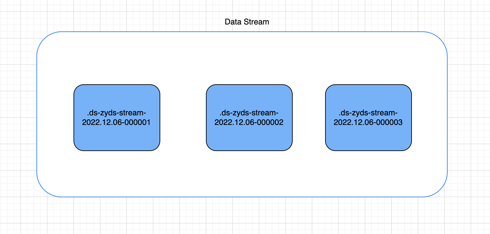
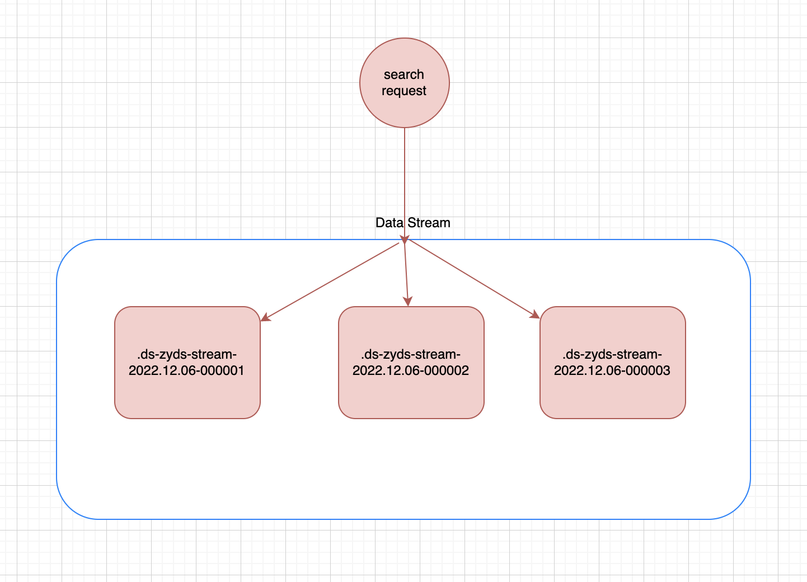
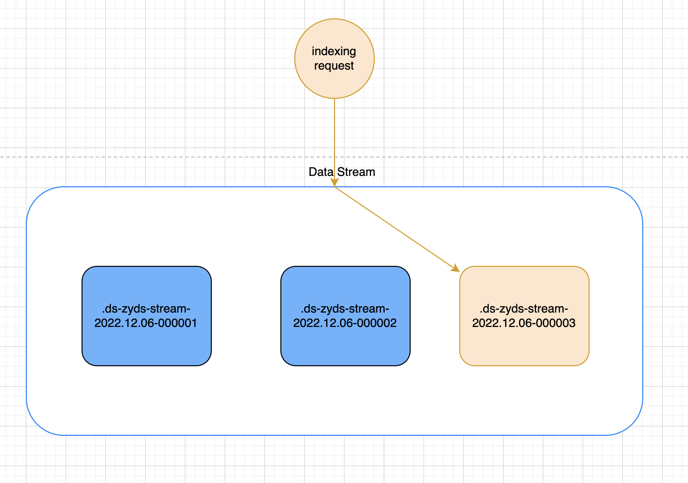

本文是《Elasticsearch索引生命周期管理ILM》中数据流索引补充篇，文章地址如下：

> https://mp.weixin.qq.com/s/ajhFp-xBU1dJm8a1dDdRQQ

并且在另一片Elasticsearch的进阶使用-动态模版中也提到了相关数据流索引的内容，有兴趣的可以回过头看一下，地址我也放下面

>  https://mp.weixin.qq.com/s/C22Zm514qq0gN7BNcnbzCQ

所以本文着重介绍下数据流索引的使用

# 数据流

数据流可以跨多个索引存储时间序列数据，同时提供一个用于请求的命名资源。数据流非常适合日志、指标、跟踪事件和持续生成的数据

我们可以将**index**和**search**请求直接提交到数据流，数据流自动将请求路由到存储流数据的索引。我们还可以使用索引生命周期管理（**ILM**）来管理这些索引，例如，我们可以使用ILM来将比较老旧的数据移动到更便宜的硬件设备上并删除不需要的索引。随着数据的增长，**ILM**策略可以降低成本和开销

数据流方案相较于其他的索引策略方案有如下几个优点

* 索引中字段数量减少：索引只存储数据的特定子集，也就是说不需要存储大量的字段索引，占用空间减少、更利于查询。并且在展示的时候只展示个别的相关字段
* 更精细的数据控制：文件系统日志、CPU、负载、网络等情况可以根据自己的安全策略定义自己的数据流索引，每个索引都有自己的滚动更新、是否保留和安全策略
* 灵活：可以使用自定义命名空间对我们的服务用例或者公司单位进行有意义的划分
* 所需的权限更少：摄取数据时只需要附加数据的权限即可

# 数据流命名方案

**Elastic Agent**使用**Elastic** 数据流命名方案来命名数据流，命名方案根据以下组件将数据拆分为不同的流

* `type`：描述数据的类型，例如：`logs`、`metrics`、`traces`、`synthetics`
* `dataset`：描述该数据流要在索引中摄取的数据范围，例如我们有一个进程指标数据集，其中一个字段是描述是否正在运行；另一个是磁盘I/O指标数据集，其中一个字段描述的是读取的字节数
* `namespace`：用户可配置的任意分组，例如环境（`dev`、`prod`、`qa`）、公司或合作企业单位。`namespace`的最大长度是100个字节。通过使用命名空间可以更轻松的从给定的数据源中搜索数据。我们还可以在创建用户角色时使用匹配模式来授权用户访问的数据权限

命名方案使用短线`-`来分割每个组件

```text
<type>-<dataset>-<namespace>
```

例如我们的生产环境集成了**Nginx**，`namespace`使用`prod`，`dataset`使用`nginx.access`，类型使用`logs`，那么我们生成的数据流如下

```text
logs-nginx.access-prod
```

# 后备索引（数据流的组成）

数据流由一个或多个**隐藏的**、自动生成的索引组成



数据流需要有匹配的索引模版，该模版配置索引支持的映射和设置

每个索引到数据流的文档都必须要包含一个字段`@timestamp`，映射为`date`或`date_nanos`字段类型，如果索引模版不指定`@timestamp`字段类型，则默认将映射为`date`类型的默认选项

同一个索引模版可以应用于多个数据流，如果当前索引模版已经被数据流使用，则不能被删除

# 读请求

当我们向数据流提交读请求时，该流会将请求路由到支持的所有索引上



# 写入请求

最近最新创建的索引是数据流的写入索引，数据流仅将新文档写入到该索引。哪怕我们直接指定其他的索引，其他索引也会拒绝该请求

对于限制写入的其他索引，我们也不能进行如下操作：`Clone`、`Delete`、`Shrink`、`Split`



# Rollover

创建数据流时，**Elasticsearch**会自动的为流创建一个后备索引，并且这个索引是第一个写入索引。我们可以使用**ILM**策略来进行管理数据流，也可以通过**API**的形式手动管理数据流

# 后备索引名称生成

一个`六位数`使用`0`填充的整数，并且滚动累积增加记数，从`000001`开始

当后备索引创建时，使用如下命名规则

```text
.ds-<data-stream>-<yyyy.MM.dd>-<generation>
```

`<yyyy.MM.dd>`表示后备索引创建的日期，日期更新的代表最新的数据

使用`shrink`或`restore`可以更改索引的名称，但是这些操作不会从数据流中删除后备索引

# 仅追加

数据流是仅追加数据的，专为很少更新现有数据（如果有的话）设计的。我们不能直接将更新或者删除请求直接发送到数据流，应该使用`update by query`或者`delete by query`来替代

如果我们需要删除数据，可以直接将请求发送到对应的后备索引中进行删除

但是删除更新操作频繁的话更推荐还是使用索引别名加索引模版的组合，而不是使用数据流

# 示例

下面是数据流索引配置ILM策略的一个**demo** ，有兴趣的可以自行尝试一下（数据流使用ILM管理的测试例子见文章开头索引生命周期的文章）

* 创建ILM策略

  ```text
  PUT _ilm/policy/zuiyu_policy
  {
    "policy": {
      "phases": {
        "hot": {
          "min_age": "0ms",
          "actions": {
            "rollover": {
              "max_docs": 10
            }
          }
        },
        "warm": {
          "min_age": "1m",
          "actions": {
            "allocate": {
              "require": {
                "data": "warm"
              }
            }
          }
        },
        "cold": {
          "min_age": "2m",
          "actions": {
            "allocate": {
              "require": {
                "data": "cold"
              }
            }
          }
        },
        "delete": {
          "min_age": "1d",
          "actions": {
            "delete": {
              "delete_searchable_snapshot": true
            }
          }
        }
      }
    }
  }
  ```

  

* 创建索引模版

  ```text
  PUT _index_template/zyds_template
  {
    "index_patterns": [
      "zyds-*"
    ],
    "data_stream": {},
    "priority": 200,
    "template": {
      "settings": {
        "number_of_shards": 3,
        "number_of_replicas": 0,
        "index.lifecycle.name": "zuiyu_policy",
        "index.routing.allocation.require.node_type": "hot"
      },
      "mappings": {
        "properties": {
          "user": {
            "type": "object"
          },
          "message": {
            "type": "keyword"
          }
        }
      }
    }
  }
  ```

  

* 创建一个`pipline`添加`@timestamp`字段

  ```text
  PUT _ingest/pipeline/add-timestamp
  {
    "processors": [
      {
        "set": {
          "field": "@timestamp",
          "value": "{{_ingest.timestamp}}"
        }
      }
    ]
  }
  ```

  

* 创建一个数据流

  ```text
  POST zyds-stream/_doc?pipeline=add-timestamp
  {
    "user": {
      "id": "zuiyu",
      "name":"鱼"
    },
    "message": "zuiyu is successful!"
  }
  ```


好了，结合前两篇文章的使用，数据流相关的到这就结束了，相信数据流这个概念大家也已经掌握，后面就是实操了，如果有疑问可在评论区告诉我，大家一起进步学习

# 参考

https://www.elastic.co/guide/en/elasticsearch/reference/8.1/data-streams.html

https://www.elastic.co/guide/en/fleet/8.1/data-streams.html

https://www.elastic.co/guide/en/elasticsearch/reference/8.1/set-up-a-data-stream.html