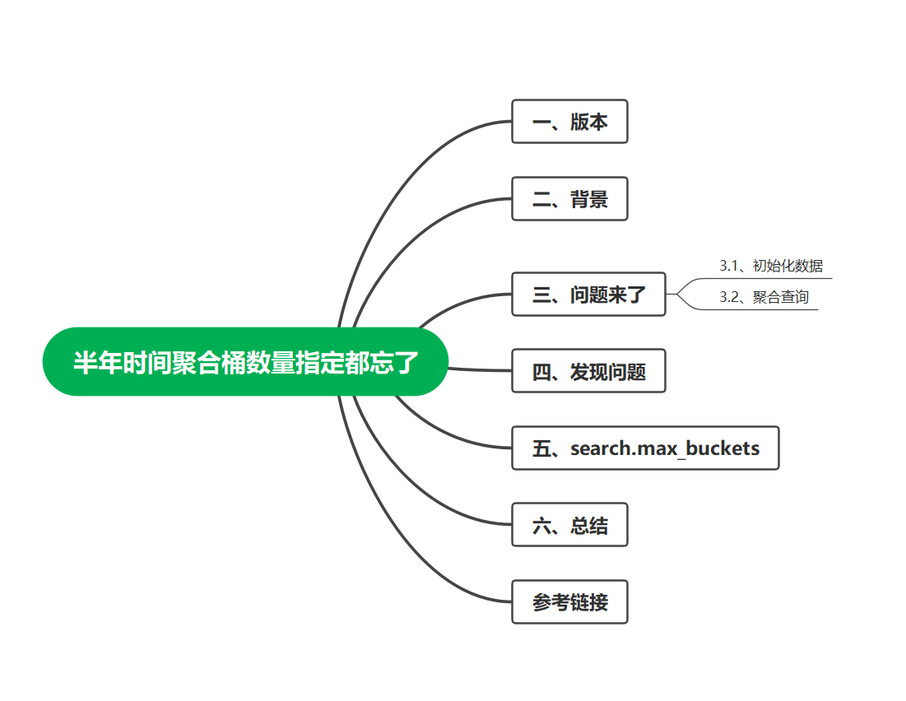
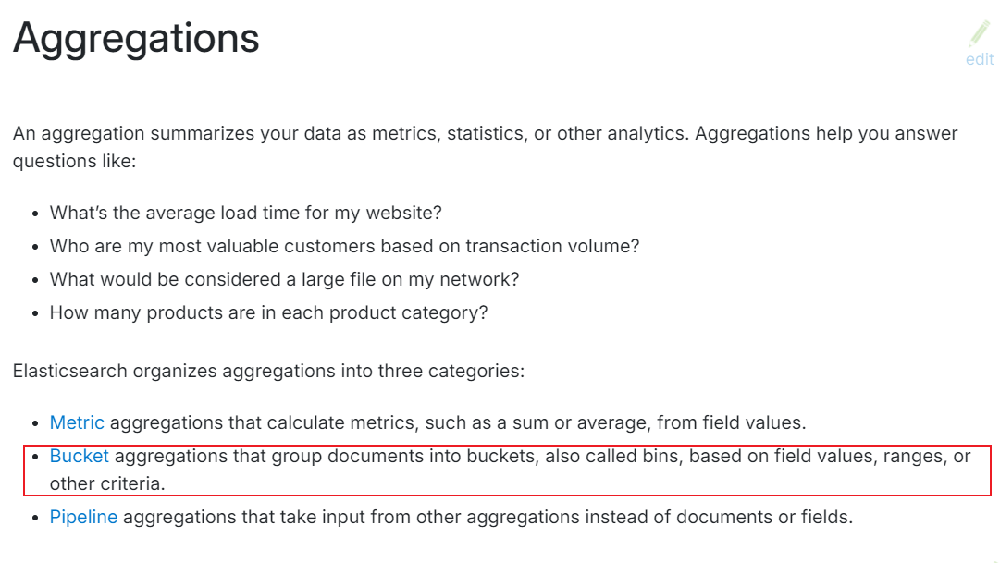
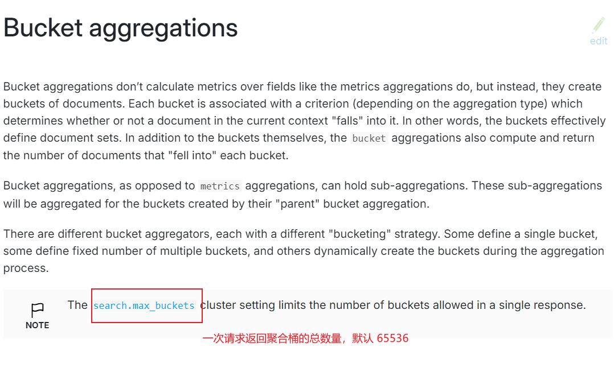
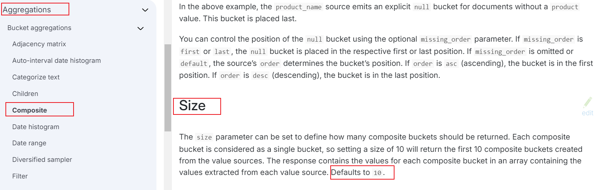
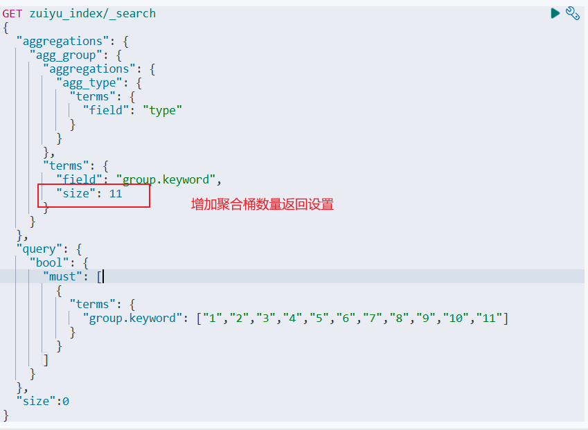

## 一、版本

* elasticsearch 8.13

## 二、背景

最近接到一个需求，将 MySQL 中的数据迁移到 Elasticsearch 中，并且相关的业务接口全部切换为使用 Elasticsearch 实现。

其中有个统计的功能，先根据 `group` 进行分组，然后对每个组内对象的 `type` 值进行分组统计。

> 举个例子：对学生进行统计，相当于先按照班级分组，在统计每个班级里面男女生的人数。

我一想切换到 Elasticsearch 中，相当于嵌套子聚合，一个聚合查询就出来结果，半小时搞定这个接口。


## 三、问题来了

### 3.1、初始化数据
```text
PUT zuiyu_index
{
  "settings": {
    "number_of_replicas": 1,
    "number_of_shards": 1
  },
  "mappings": {
    "properties": {
      "group": {
        "type": "text",
        "fields": {
          "keyword": {
            "type": "keyword",
            "ignore_above": 256
          }
        }
      },
      "type": {
        "type": "long"
      }
    }
  }
}

POST _bulk
{ "index" : { "_index" : "zuiyu_index", "_id" : "1" } }
{ "group" : "1","type":1 ,"sort":1}
{ "index" : { "_index" : "zuiyu_index", "_id" : "2" } }
{ "group" : "1","type":2 ,"sort":1}
{ "index" : { "_index" : "zuiyu_index", "_id" : "3" } }
{ "group" : "1","type":3 ,"sort":1}
{ "index" : { "_index" : "zuiyu_index", "_id" : "4" } }
{ "group" : "2","type":1 ,"sort":1}
{ "index" : { "_index" : "zuiyu_index", "_id" : "5" } }
{ "group" : "2","type":1 ,"sort":1}
{ "index" : { "_index" : "zuiyu_index", "_id" : "6" } }
{ "group" : "2","type":1 ,"sort":1}
{ "index" : { "_index" : "zuiyu_index", "_id" : "7" } }
{ "group" : "3","type":2 ,"sort":1}
{ "index" : { "_index" : "zuiyu_index", "_id" : "8" } }
{ "group" : "4","type":1 ,"sort":1}
{ "index" : { "_index" : "zuiyu_index", "_id" : "9" } }
{ "group" : "5","type":1 ,"sort":1}
{ "index" : { "_index" : "zuiyu_index", "_id" : "10" } }
{ "group" : "6","type":1 ,"sort":1}
{ "index" : { "_index" : "zuiyu_index", "_id" : "11" } }
{ "group" : "7","type":1 ,"sort":1}
{ "index" : { "_index" : "zuiyu_index", "_id" : "12" } }
{ "group" : "8","type":1 ,"sort":1}
{ "index" : { "_index" : "zuiyu_index", "_id" : "13" } }
{ "group" : "9","type":1 ,"sort":1}
{ "index" : { "_index" : "zuiyu_index", "_id" : "14" } }
{ "group" : "10","type":1 ,"sort":1}
{ "index" : { "_index" : "zuiyu_index", "_id" : "15" } }
{ "group" : "10","type":2 ,"sort":1}
{ "index" : { "_index" : "zuiyu_index", "_id" : "16" } }
{ "group" : "11","type":1 ,"sort":1}
{ "index" : { "_index" : "zuiyu_index", "_id" : "17" } }
{ "group" : "11","type":3 ,"sort":1}
```

像这种简单的一条 sql 就出来结果的业务，我一般都是先写个 sql 语句，然后根据 sql 再写代码。所以这里我就先写了个DSL语句。

### 3.2、聚合查询

```text
GET zuiyu_index/_search
{
  "aggregations": {
    "agg_group": {
      "aggregations": {
        "agg_type": {
          "terms": {
            "field": "type"
          }
        }
      },
      "terms": {
        "field": "group.keyword"
      }
    }
  },
  "query": {
    "bool": {
      "must": [
        {
          "terms": {
            "group.keyword": ["1","2","3","4","5","6","7","8","9","10","11"]
          }
        }
      ]
    }
  },
  "size":0
}
```
同学们可以看一下上面的语句有问题吗，如果你能发现问题，那么这篇文章也希望你能看下去，也许会有意想不到的收获。

> 提示一下：就像标题所说，可以关心一下聚合桶的数量。

## 四、发现问题

上述 DSL 语句执行之后，**大眼一看** ，结果 OK，是我想要的，那就按这个逻辑直接写 Java 代码。
上述 DSL 语句中聚合操作对应的 Java 代码如下：

```text
 Aggregation aggType = Aggregation.of(agg -> agg.terms(t -> t.field("type")));
 Aggregation aggGroup = Aggregation.of(agg -> agg.terms(t -> t.field("group"))
                .aggregations("agg_type", aggType));
                
```

做接口数据层的迁移，最简单的就是修改完业务代码之后直接对比返回结果，保持返回结果的一致，这样的修改对于前端来说没有影响。

所以，修改完代码之后直接拿接口的返回值与修改之前的版本进行比对，验证业务逻辑是否一致。直接 F12 控制台，找到该接口的返回值，复制，粘贴到对比工具中，进行对比。

> 此处使用的对比工具是 Beyond Compare 。

通过对比返回结果发现，**聚合桶的数量少了一个**。

上面的例子中，我们的预期结果是，最外层 group 的分组最少11个，排除 group 不存在的情况。这里 terms 中条件 group 在索引中都已存在。

然后我就赶紧再去执行了一遍上面 DSL 语句，一个一个的验证聚合桶，发现返回结果中竟然没有 `group=9` 的桶存在。

DSL 返回结果如下

```text
{
  "took": 2,
  "timed_out": false,
  "_shards": {
    "total": 1,
    "successful": 1,
    "skipped": 0,
    "failed": 0
  },
  "hits": {
    "total": {
      "value": 17,
      "relation": "eq"
    },
    "max_score": null,
    "hits": []
  },
  "aggregations": {
    "agg_group": {
      "doc_count_error_upper_bound": 0,
      "sum_other_doc_count": 1,
      "buckets": [
        {
          "key": "1",
          "doc_count": 3,
          "agg_type": {
            "doc_count_error_upper_bound": 0,
            "sum_other_doc_count": 0,
            "buckets": [
              {
                "key": 1,
                "doc_count": 1
              },
              {
                "key": 2,
                "doc_count": 1
              },
              {
                "key": 3,
                "doc_count": 1
              }
            ]
          }
        },
        {
          "key": "2",
          "doc_count": 3,
          "agg_type": {
            "doc_count_error_upper_bound": 0,
            "sum_other_doc_count": 0,
            "buckets": [
              {
                "key": 1,
                "doc_count": 3
              }
            ]
          }
        },
        {
          "key": "10",
          "doc_count": 2,
          "agg_type": {
            "doc_count_error_upper_bound": 0,
            "sum_other_doc_count": 0,
            "buckets": [
              {
                "key": 1,
                "doc_count": 1
              },
              {
                "key": 2,
                "doc_count": 1
              }
            ]
          }
        },
        {
          "key": "11",
          "doc_count": 2,
          "agg_type": {
            "doc_count_error_upper_bound": 0,
            "sum_other_doc_count": 0,
            "buckets": [
              {
                "key": 1,
                "doc_count": 1
              },
              {
                "key": 3,
                "doc_count": 1
              }
            ]
          }
        },
        {
          "key": "3",
          "doc_count": 1,
          "agg_type": {
            "doc_count_error_upper_bound": 0,
            "sum_other_doc_count": 0,
            "buckets": [
              {
                "key": 2,
                "doc_count": 1
              }
            ]
          }
        },
        {
          "key": "4",
          "doc_count": 1,
          "agg_type": {
            "doc_count_error_upper_bound": 0,
            "sum_other_doc_count": 0,
            "buckets": [
              {
                "key": 1,
                "doc_count": 1
              }
            ]
          }
        },
        {
          "key": "5",
          "doc_count": 1,
          "agg_type": {
            "doc_count_error_upper_bound": 0,
            "sum_other_doc_count": 0,
            "buckets": [
              {
                "key": 1,
                "doc_count": 1
              }
            ]
          }
        },
        {
          "key": "6",
          "doc_count": 1,
          "agg_type": {
            "doc_count_error_upper_bound": 0,
            "sum_other_doc_count": 0,
            "buckets": [
              {
                "key": 1,
                "doc_count": 1
              }
            ]
          }
        },
        {
          "key": "7",
          "doc_count": 1,
          "agg_type": {
            "doc_count_error_upper_bound": 0,
            "sum_other_doc_count": 0,
            "buckets": [
              {
                "key": 1,
                "doc_count": 1
              }
            ]
          }
        },
        {
          "key": "8",
          "doc_count": 1,
          "agg_type": {
            "doc_count_error_upper_bound": 0,
            "sum_other_doc_count": 0,
            "buckets": [
              {
                "key": 1,
                "doc_count": 1
              }
            ]
          }
        }
      ]
    }
  }
}
```

到了这，其实我还没想到是什么原因造成的，然后看了好几遍的聚合语句，都没有发现问题。一度的自我怀疑，聚合不是这样用的吗，嵌套的聚合难道还有花样？

* 查阅官方文档

官方文档肯定是最权威的，所以去官方文档看看吧，是不是可以给自己点灵感，找到解决方案。

首先去的是如下地址：
> [https://www.elastic.co/guide/en/elasticsearch/reference/current/search-aggregations.html#run-sub-aggs](https://www.elastic.co/guide/en/elasticsearch/reference/current/search-aggregations.html#run-sub-aggs)


官方给的代码示例好简单，确实没毛病，对我没啥启发，告辞转下个网页。

还是这个网页，回到页面顶端，有一个 `Bucket` 字样的地方，点进去。



> [https://www.elastic.co/guide/en/elasticsearch/reference/current/search-aggregations-bucket.html](https://www.elastic.co/guide/en/elasticsearch/reference/current/search-aggregations-bucket.html)



在这个页面，发现可以通过 `search.max_buckets` 设置请求返回聚合桶的总数，然后我脑海中那丢失的记忆回来了。

想起了在 Elasticsearch 聚合时，聚合桶的返回数量是可以指定的，但是怎么指定，参数是什么，我又忘了。


但是大方向肯定是这个了，我就开始找相关的资料，翻阅官网关于聚合的文档，终于在官方文档的嵌套聚合中找到了相关的说明。

> [https://www.elastic.co/guide/en/elasticsearch/reference/current/search-aggregations-bucket-composite-aggregation.html#_size](https://www.elastic.co/guide/en/elasticsearch/reference/current/search-aggregations-bucket-composite-aggregation.html#_size)



大体意思就是`size`参数可以控制返回聚合桶的数量，默认 `10`。

但是这里也没有给出示例，我还是不会用啊。

毕竟咱也是有点 ES 基础的，内心其实已经有了想法，大概知道怎么用了，只是还得需要确认下。

最后想起来之前写过关于聚合的文章，抱着试试看的态度，在回顾一下吧。

> [聚合在Elasticsearch中的使用及示例验证](https://mp.weixin.qq.com/s/18bz77nwgC_tF8l_jYD3CA)

发文日期，2023年8月2日，真是老了，才半年多的时间都忘了，好了回到主题。

在这篇文档中，发现了 `size` 参数的使用，在这里终于确认，聚合桶数量需要指定，并且根据自己的查询条件进行设置，或直接设置一个最大值兼容自己所有的聚合请求。

所以修改之后的 DSL 语句如下：

```text
GET zuiyu_index/_search
{
  "aggregations": {
    "agg_group": {
      "aggregations": {
        "agg_type": {
          "terms": {
            "field": "type"
          }
        }
      },
      "terms": {
        "field": "group.keyword",
        "size": 11
      }
    }
  },
  "query": {
    "bool": {
      "must": [
        {
          "terms": {
            "group.keyword": ["1","2","3","4","5","6","7","8","9","10","11"]
          }
        }
      ]
    }
  },
  "size":0
}
```



相对应的 Java 代码也修改:

```text
 Aggregation aggType = Aggregation.of(agg -> agg.terms(t -> t.field("type")));
 Aggregation aggGroup = Aggregation.of(agg -> agg.terms(t -> t.field("group").size(groupList.size())
                .aggregations("agg_type", aggType));
```

* groupList.size() 为 terms 查询条件值的数量。


## 五、search.max_buckets

可以通过 `_cluster` 的 API 设置此参数。

```text
PUT _cluster/settings
{
  "transient": {
    "search.max_buckets":100
  }
}
```

> 此处使用的是 `transient` ，还可以使用 `persistent`,他俩的区别就是`transient` 的配置会在集群重启之后失效，`persistent`会持久化保存。
>
> 其中这个参数在之前的索引分片分配策略一文中讲过了，还没看过的可以跳过去看一下，链接我放下面。
>
> [Elasticsearch Index Shard Allocation 索引分片分配策略](https://mp.weixin.qq.com/s/Rlu-GDNwnAUR3tzJYkm5Aw)

## 六、总结

本文通过 demo 示例，从发现聚合桶数量丢失，到排查产生丢失的问题，最后通过 `size` 参数解决聚合桶数量丢失问题的过程。

意外收获的是一次请求返回聚合桶数量的总数也是可以通过 `search.max_buckets`设置的。

日常的积累固然重要，熟悉官方文档中相关 API 的位置也是必不可少的。

工作中你遇到问题是如何排查的呢，会不会查阅官网文档呢？欢迎在评论区沟通交流，大家一起学习进步！

## 参考链接

[https://www.elastic.co/guide/en/elasticsearch/reference/current/search-aggregations.html](https://www.elastic.co/guide/en/elasticsearch/reference/current/search-aggregations.html
)
[https://www.elastic.co/guide/en/elasticsearch/reference/current/search-aggregations-bucket.html](https://www.elastic.co/guide/en/elasticsearch/reference/current/search-aggregations-bucket.html)

[https://www.elastic.co/guide/en/elasticsearch/reference/current/search-aggregations-bucket-composite-aggregation.html](https://www.elastic.co/guide/en/elasticsearch/reference/current/search-aggregations-bucket-composite-aggregation.html)

[https://mp.weixin.qq.com/s/18bz77nwgC_tF8l_jYD3CA](https://mp.weixin.qq.com/s/18bz77nwgC_tF8l_jYD3CA)

[https://mp.weixin.qq.com/s/Rlu-GDNwnAUR3tzJYkm5Aw](https://mp.weixin.qq.com/s/Rlu-GDNwnAUR3tzJYkm5Aw)


