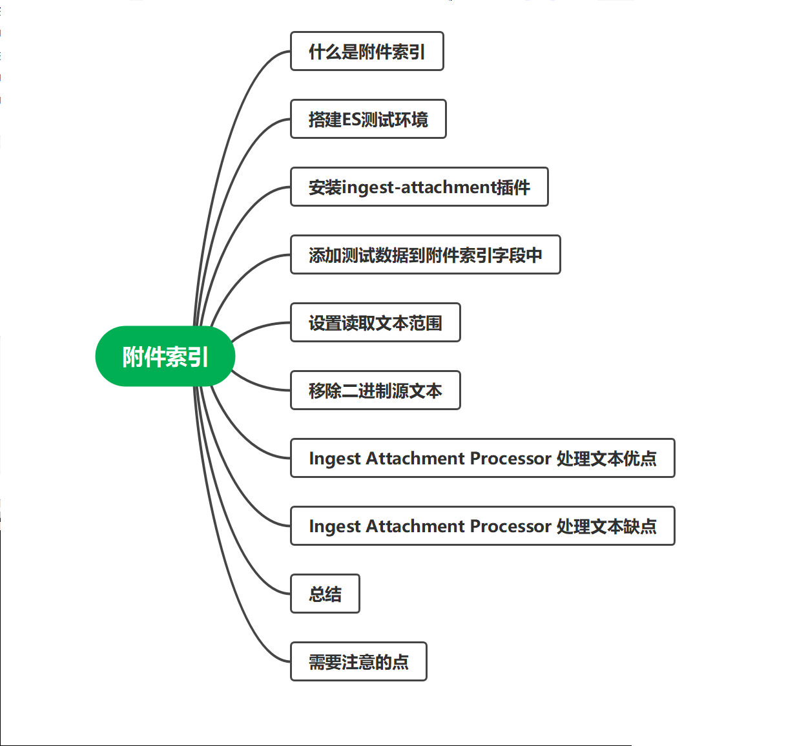
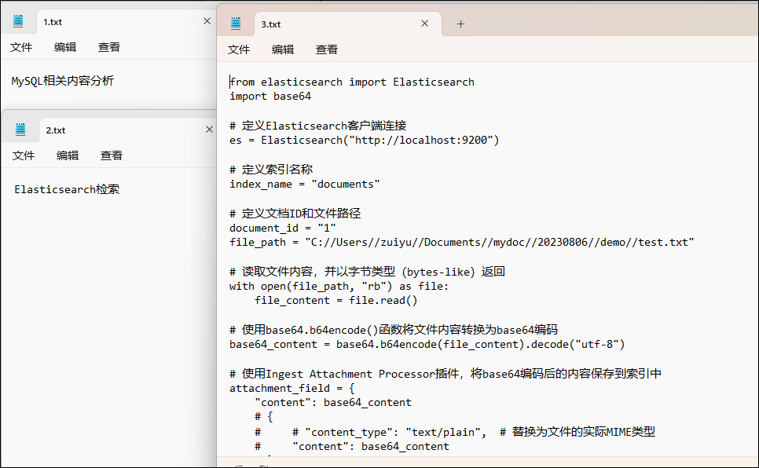
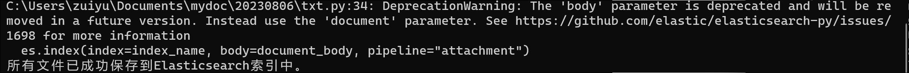

# 一、简介

**Elasticsearch**附件索引是需要插件支持的功能，它允许将文件内容附加到**Elasticsearch**文档中，并对这些附件内容进行全文检索。本文将带你了解索引附件的原理和使用方法，并通过一个实际示例来说明如何在**Elasticsearch**中索引和检索文件附件。

索引附件的核心原理是通过**Ingest Attachment Processor**将文件内容转换成**Elasticsearch**文档中的字段。该插件使用**Apache Tika**来提取文档中的附件内容，并将其转换为可索引的文本。

# 二、环境

```text
version: '3.8'
services:
  cerebro:
    image: lmenezes/cerebro:0.8.3
    container_name: cerebro
    ports:
     - "9000:9000"
    command:
     - -Dhosts.0.host=http://eshot:9200
    networks:
     - elastic
  kibana:
    image: docker.elastic.co/kibana/kibana:8.1.3
    container_name: kibana
    environment:
      - I18N_LOCALE=zh-CN
      - XPACK_GRAPH_ENABLED=true
      - TIMELION_ENABLED=true
      - XPACK_MONITORING_COLLECTION_ENABLED="true"
      - ELASTICSEARCH_HOSTS=http://eshot:9200
      - server.publicBaseUrl=http://192.168.160.234:5601
    ports:
      - "5601:5601"
    networks:
      - elastic
  eshot:
    image: elasticsearch:8.1.3
    container_name: eshot
    environment:
      - node.name=eshot
      - cluster.name=es-docker-cluster
      - discovery.seed_hosts=eshot,eswarm,escold
      - cluster.initial_master_nodes=eshot,eswarm,escold
      - bootstrap.memory_lock=true
      - "ES_JAVA_OPTS=-Xms512m -Xmx512m"
      - xpack.security.enabled=false
      - node.attr.node_type=hot
    ulimits:
      memlock:
        soft: -1
        hard: -1
    volumes:
      - D:\zuiyuftp\docker\es8.1\eshot\data:/usr/share/elasticsearch/data
      - D:\zuiyuftp\docker\es8.1\eshot\logs:/usr/share/elasticsearch/logs
      - D:\zuiyuftp\docker\es8.1\eshot\plugins:/usr/share/elasticsearch/plugins
    ports:
      - 9200:9200
    networks:
      - elastic
  eswarm:
    image: elasticsearch:8.1.3
    container_name: eswarm
    environment:
      - node.name=eswarm
      - cluster.name=es-docker-cluster
      - discovery.seed_hosts=eshot,eswarm,escold
      - cluster.initial_master_nodes=eshot,eswarm,escold
      - bootstrap.memory_lock=true
      - "ES_JAVA_OPTS=-Xms512m -Xmx512m"
      - xpack.security.enabled=false
      - node.attr.node_type=warm
    ulimits:
      memlock:
        soft: -1
        hard: -1
    volumes:
      - D:\zuiyuftp\docker\es8.1\eswarm\data:/usr/share/elasticsearch/data
      - D:\zuiyuftp\docker\es8.1\eswarm\logs:/usr/share/elasticsearch/logs
      - D:\zuiyuftp\docker\es8.1\eshot\plugins:/usr/share/elasticsearch/plugins
    networks:
      - elastic
  escold:
    image: elasticsearch:8.1.3
    container_name: escold
    environment:
      - node.name=escold
      - cluster.name=es-docker-cluster
      - discovery.seed_hosts=eshot,eswarm,escold
      - cluster.initial_master_nodes=eshot,eswarm,escold
      - bootstrap.memory_lock=true
      - "ES_JAVA_OPTS=-Xms512m -Xmx512m"
      - xpack.security.enabled=false
      - node.attr.node_type=cold
    ulimits:
      memlock:
        soft: -1
        hard: -1
    volumes:
      - D:\zuiyuftp\docker\es8.1\escold\data:/usr/share/elasticsearch/data
      - D:\zuiyuftp\docker\es8.1\escold\logs:/usr/share/elasticsearch/logs
      - D:\zuiyuftp\docker\es8.1\eshot\plugins:/usr/share/elasticsearch/plugins
    networks:
      - elastic

# volumes:
#   eshotdata:
#     driver: local
#   eswarmdata:
#     driver: local
#   escolddata:
#     driver: local

networks:
  elastic:
    driver: bridge

```

# 三、安装 ingest-attachment 插件

首先创建一个处理文本的管道，指定读取文档中`content`字段的内容进行处理

```text
PUT _ingest/pipeline/attachment
{
  "description" : "Extract attachment information",
  "processors" : [
    {
      "attachment" : {
        "field" : "content"
      }
    }
  ]
}
```

我们的**elasticsearch**版本是`8.1`，所以默认还是没有内置的，需要手动添加一下，因为我是**docker**启动的，所以进入到**docker**容器内部，执行如下命令进行安装

```text
./bin/elasticsearch-plugin install ingest-attachment
```

安装完成之后进行重启**elasticsearch**集群进行激活插件的启用

> 我这边是三个节点，在hot节点下安装完成之后只会在当前节点下有此插件

现在插件已经安装好了，继续执行刚才的定义文本处理通道进行创建

```text
PUT _ingest/pipeline/attachment
{
  "description" : "Extract attachment information",
  "processors" : [
    {
      "attachment" : {
        "field" : "content"
      }
    }
  ]
}
```

在上面的定义中指定的`attachment`的过滤字段是`content`，所以我们在写入**elasticsearch**索引内容时，文件的内容需要保存到`content`字段中

# 四、添加测试数据

下面我们创建一个保存文档详细信息的索引，比如文件题名，类型，文件内容等字段

```text
PUT /zfc-doc-000003
{
  "mappings": {
    "properties": {
      "id":{
        "type": "keyword"
      },
      "title":{
        "type": "text",
        "analyzer": "ik_max_word"
      },
      "content": {
        "type": "text",
        "analyzer": "ik_max_word"
      }
    }
  }
}
```

通过上面两步的操作之后我们的测试环境就算搭建完成了，下面就可以进行大文本内容的读取测试了，首先我们还是准备几个测试的文本文件，比如`txt`，`doc`，`pdf`等类型的纯文本文件

下面使用`python`脚本写入索引内容，首先安装一下`elasticsearch`的相关依赖

```text
pip install elasticsearch
```

下面是读取文件夹`C://Users//zuiyu//Documents//mydoc//20230806//demo//1`下的所有文本文件保存到`elasticsearch`的索引`zfc-doc-000003`中的python脚本，保存为`txt.py`后面会用到

```python
import os
from elasticsearch import Elasticsearch
import base64

# 定义Elasticsearch客户端连接
es = Elasticsearch("http://localhost:9200")

# 定义索引名称
index_name = "zfc-doc-000003"

# 定义文件夹路径
folder_path = "C://Users//zuiyu//Documents//mydoc//20230806//demo//1"

# 遍历文件夹下的所有文件
for root, dirs, files in os.walk(folder_path):
    for filename in files:
        # 构建文件的完整路径
        file_path = os.path.join(root, filename)

        # 读取文件内容，并以字节类型（bytes-like）返回
        with open(file_path, "rb") as file:
            file_content = file.read()

        # 使用base64.b64encode()函数将文件内容转换为base64编码
        base64_content = base64.b64encode(file_content).decode("utf-8")

        # 构建索引文档
        document_body = {
            "title": filename,  # 使用文件名作为文档标题
            "content": base64_content  # 将base64编码后的内容保存到字段 "content" 中
        }

        # 执行索引操作，并指定pipeline为 "attachment"
        es.index(index=index_name, body=document_body, pipeline="attachment")

print("所有文件已成功保存到Elasticsearch索引中。")

```

该脚本中需要注意的点有如下三个

1、**elasticsearch**服务器地址

2、需要读取的文件夹地址

3、保存的索引名称与保存文本内容的字段名称

4、指定创建的`pipeline`

`C://Users//zuiyu//Documents//mydoc//20230806//demo//1`文件夹下有三个文件用来做测试，他们的文本内容分别如下图所示



> 其中为了方便测试，1.txt与2.txt仅有一句话

下面执行`python`脚本`txt.py`保存到`elasticsearch`的`zfc-doc-000003`中，并指定使用`pipeline`为`attachment`

```text
python txt.py
```

脚本执行成功之后的截图如下图所示，输出`所有文件已成功保存到Elasticsearch索引中。`即为成功导入



下面我们进行检索验证，因为上面咱们创建的索引中，文本内容是保存到`content`字段中的，所以我们对`content`字段进行分词检索（`content`使用的是`ik分词器`，不是很了解的可以参考之前的文章进行一下安装）

1、首先检索条件是`内容`，预期结果是返回第一个文档与第三个文档

2、再次检索`mysql`，返回第一个文档

通过上面两个小例子，可以验证出来的结论就是，我们在文本内容过大需要对内容进行检索时，可以使用提前指定的`pipeline`进行预处理

# 五、设置读取文本范围

在**Elasticsearch**中，**Ingest Attachment Processor**插件的`indexed_chars`参数默认值是`100000`，表示将文本内容的前`100000`保存在索引字段中

如果将其设置为`-1`，**Elasticsearch**会保存所有文本内容。**这可能会导致索引文档过大，对性能和资源造成影响，特别是当处理大文本时。**

为了避免索引文档过大的问题，我们可以根据实际情况设置`indexed_chars`参数，将其设置为较小的值，限制保存的字符数。这样可以减小索引文档的大小，降低**Elasticsearch**的负担。

假如限制保存的字符数为`50000`，可以如下设置：

```json
PUT _ingest/pipeline/attachment
{
  "description": "Pipeline for processing attachments",
  "processors": [
    {
      "attachment": {
        "field": "content",
        "indexed_chars": 50000
      }
    }
  ]
}
```

这样，只有前`50000`个字符会被保存在`content`字段中，而超过这个字符数的部分则会被截断，不会保存在索引中。

如果想单独设定某个文档的取值范围，也可以在索引的文档中指定字段值，举例如下

```text
PUT _ingest/pipeline/attachment_max
{
  "description" : "Extract attachment information",
  "processors" : [
    {
      "attachment" : {
        "field" : "content",
        "indexed_chars": 6,
        "indexed_chars_field" : "max_size",
      }
    }
  ]
}
PUT /zfc-doc-000005
{
  "mappings": {
    "properties": {
      "id":{
        "type": "keyword"
      },
      "title":{
        "type": "text",
        "analyzer": "ik_max_word"
      },
      "content": {
        "type": "text",
        "analyzer": "ik_max_word"
      }
    }
  }
}
POST zfc-doc-000005/_doc?pipeline=attachment_max
{
  "id":"10",
"content":"5Litc2FkZ+eahOmqhOWCsuWIu+W9leacuuWNoea0m+aWr+Wkp+iSnOS7t+agvOWWgOS7gOinieW+l+aWr+WNoeaLiemjkuWNjg==",
  "max_size":10
}
POST zfc-doc-000005/_doc?pipeline=attachment_max
{
  "id":"11",
  "content":"5Litc2FkZ+eahOmqhOWCsuWIu+W9leacuuWNoea0m+aWr+Wkp+iSnOS7t+agvOWWgOS7gOinieW+l+aWr+WNoeaLiemjkuWNjg=="
}
GET zfc-doc-000005/_search
{
  "query": {
    "term": {
      "id": {
        "value": "11"
      }
    }
  }
}
```

使用`"indexed_chars_field" : "max_size"`,指定文档中的字段，根据文档中的`max_size`字段来决定要取多少文本索引到字段中，如果文档中没有指定`max_size`则使用`pipeline`中指定的`indexed_chars`大小

# 六、移除二进制源文本

除了使用上述指定读取文本文件的指定长度，还可以使用另一个参数` "remove_binary": true`控制来判断是否保存二进制编码的文本

```text
PUT _ingest/pipeline/attachment_max
{
  "description" : "Extract attachment information",
  "processors" : [
    {
      "attachment" : {
        "field" : "content",
        "remove_binary": true
      }
    }
  ]
}
```

`remove_binary` 设置为`true`即不保存原始二进制文本，只会保存解析之后的结果，这种处理方式可以大大的减少存储空间

# 七、优点

1. 轻量化索引文档：使用**Ingest Attachment Processor**处理文本内容时，只会将文本的元数据（例如文件路径或URL）以及转换后的**attachment**类型的内容保存在索引文档中，而不是保存整个文本内容。这样可以显著减小索引文档的大小，节省存储空间，并提高索引和检索的性能。

2. 全文搜索功能：通过**Pipeline**中的**Ingest Attachment Processor**处理文本内容后，**Elasticsearch**可以支持全文搜索功能，可以对文本进行全文检索，查找包含指定关键词的文档。

3. 灵活的数据处理：**Pipeline**机制允许在文本内容存储到Elasticsearch之前进行预处理。可以通过**Pipeline**添加其他处理器来进行数据转换、清理或提取。

4. 易于维护和扩展：使用**Pipeline**可以将数据处理逻辑与索引操作解耦，使代码结构更清晰，易于维护和扩展。如果以后有其他数据处理需求，只需要修改**Pipeline**而不需要修改索引操作。

5. 可以实现附件类型：使用**Ingest Attachment Processor**可以将文本内容转换为**attachment**类型，这是**Elasticsearch**内置的一种特殊数据类型，支持对文档内容的索引和全文检索。


# 八、缺点

1. 存储需求：虽然使用**attachment**类型可以减小索引文档的大小，但是仍然需要在**Elasticsearch**中存储文本内容的转换结果。对于大量大文本内容的情况，仍需要较大的存储空间，并且最好使用`"remove_binary": true`移除二进制文本。

2. 内存消耗：在处理大文本内容时，**Ingest Attachment Processor**需要将文本内容暂存到内存中进行处理，因此会消耗较多的内存资源。如果处理大量大文本，可能导致内存压力增加，影响性能。

3. 处理性能：虽然使用**Pipeline**可以在索引之前进行预处理，但**Ingest Attachment Processor**的处理速度仍然会受到限制。在处理大量大文本内容时，可能导致处理速度较慢，影响索引性能。

4. 不适用于实时场景：由于**Ingest Attachment Processor**处理文本内容需要较多的计算和存储资源，适用于离线或批处理的场景。对于实时索引或对性能要求较高的场景，可能需要考虑其他方案。

5. 不支持所有文件类型：虽然**attachment**类型支持多种文件类型，但仍有一些特殊文件类型可能不受支持。在使用**Pipeline**中的**Ingest Attachment Processor**处理文本内容时，需要注意文件类型的兼容性。

6. 额外的配置和维护：使用**Pipeline**需要额外的配置和维护，需要定义处理器、设置参数等

7. 依赖插件：**Ingest Attachment Processor**是**Elasticsearch**的一个插件，需要确保插件的版本与**Elasticsearch**版本兼容


# 九、总结

使用**Pipeline**中的**Ingest Attachment Processor**处理文本内容可以在不影响检索功能的前提下，优化索引文档的大小，提高索引和检索的性能，并灵活地处理和扩展数据。这是处理大文本内容时的一种高效和可靠的方式。虽然**Pipeline**中的**Ingest Attachment Processor**处理大文本内容是一种高效和灵活的方式，但仍然存在一些挑战和限制。在实际使用中，需要综合考虑实际需求、资源限制和性能要求，选择合适的处理方案。如果处理大量大文本或对性能要求较高，可能需要考虑其他优化措施或方案。


# 十、需要注意的点

1. 索引性能：处理大文本时，**Pipeline**的执行可能会占用较多的CPU和内存资源，特别是在处理多个大文本时。这可能会对**Elasticsearch**的索引性能和整体系统性能造成影响。在处理大文本之前，建议评估系统的性能和资源利用情况，确保系统有足够的资源来执行处理。

2. 超时设置：**Pipeline**的执行可能需要一定的时间，尤其是在处理大文本时。如果**Pipeline**的执行时间超过了**Elasticsearch**的默认超时设置，可能会导致任务失败。你可以通过设置`timeout`参数来延长超时时间，确保**Pipeline**有足够的时间来执行。

3. 错误处理：在**Pipeline**的处理过程中，可能会出现各种错误，例如文本解析错误、索引失败等。你需要注意适当处理这些错误，以避免任务失败导致整个操作中断。可以使用适当的异常处理机制，或者使用**Elasticsearch**的**Bulk API**来进行批量索引，确保部分文档处理失败时，不会影响其他文档的索引。

4. 内存管理：处理大文本时，可能会产生较大的临时数据，需要注意内存的管理和及时释放。确保处理过程中不会产生内存泄漏或内存溢出问题。

5. 文件路径安全性：如果使用文件路径来索引文本内容，需要注意文件路径的安全性。确保文件路径是合法的、可信的，并限制访问范围，避免可能的安全风险。

6. 版本兼容性：使用**Pipeline**时，需要注意插件的版本与Elasticsearch的版本兼容性。确保使用的**Pipeline**插件与**Elasticsearch**版本兼容，并定期升级插件以保持稳定性和安全性。

总的来说，处理大文本时，需要综合考虑性能、资源利用、错误处理等方面的问题，合理设计和优化Pipeline的处理过程。在实际应用中，可以进行压力测试和性能测试，找到最合适的处理方案，确保系统能够稳定高效地处理大文本内容。


# 参考链接

https://www.elastic.co/guide/en/elasticsearch/reference/8.9/attachment.html